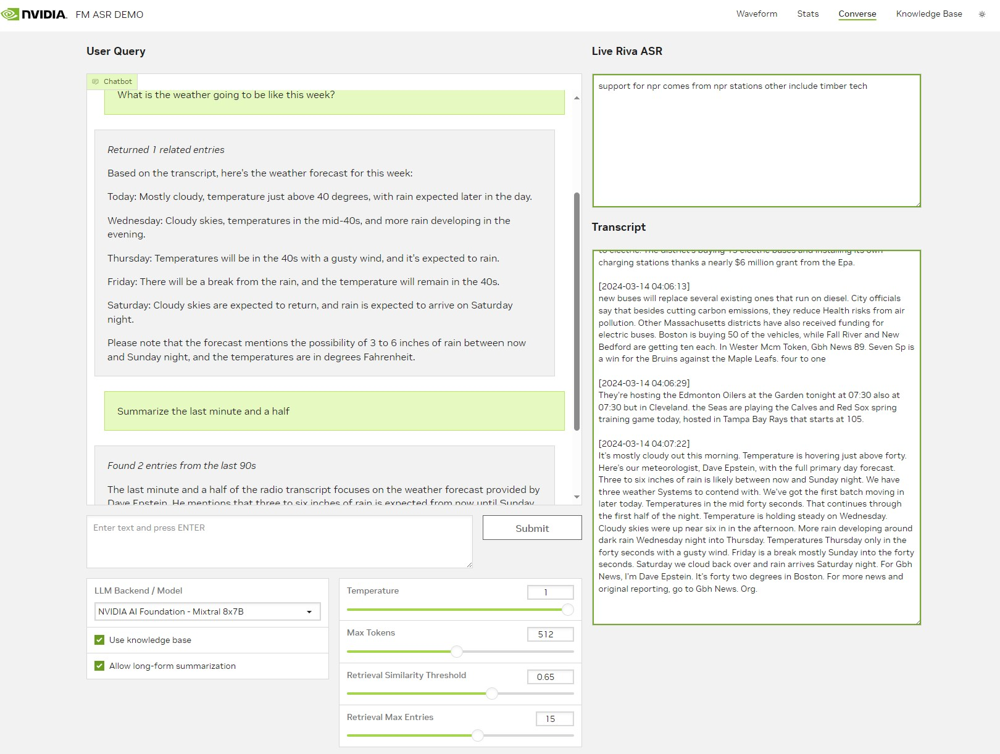
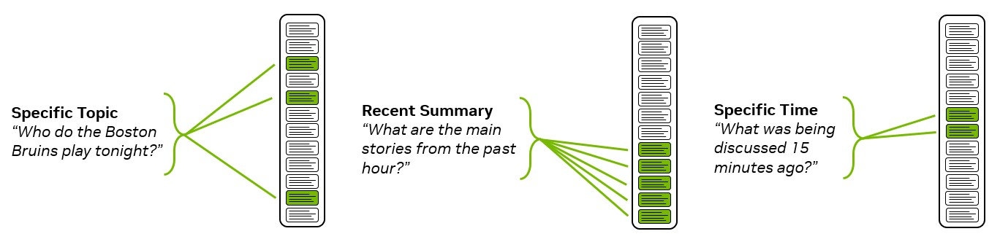
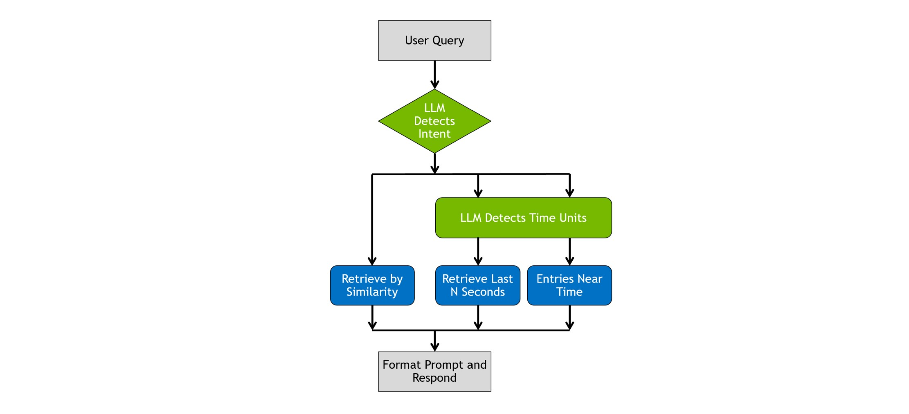
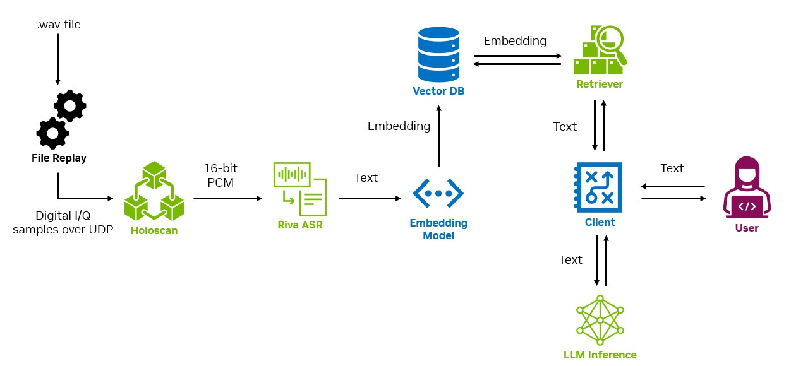
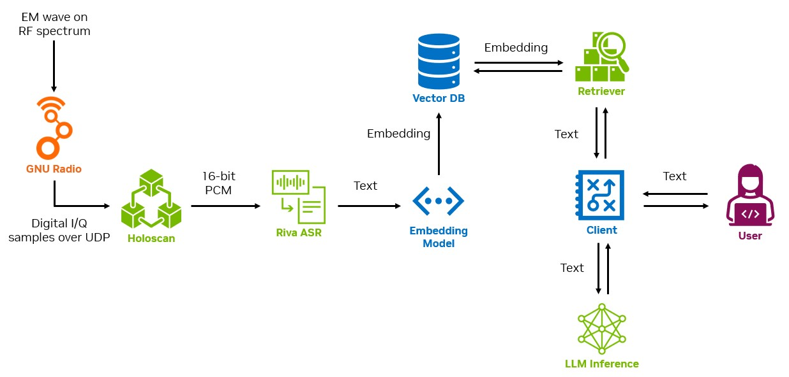

# Streaming FM Radio RAG
This repository enables live processing of FM baseband I/Q samples, automatic speech recognition (ASR) of the resulting audio, and LLM interaction with the transcribed audio.

If you don't have an SDR capable of recieving FM, that's ok. Code in the `file-replay` container will read in `.wav` audio files, do signal processing to FM-modulate them, and send the data as UDP packets. From the perspective of the pipeline, this file replay data looks equivalent to data streamed in from an FM source.



## Tools
- [NVIDIA Holoscan SDK](https://developer.nvidia.com/holoscan-sdk) - UDP data ingest and signal processing
- [NVIDIA Riva](https://www.nvidia.com/en-us/ai-data-science/products/riva/) - ASR
- [NVIDIA AI Foundation Endpoint](https://www.nvidia.com/en-us/ai-data-science/foundation-models/) - Optimized LLM inference running on the cloud
- [NVIDIA NIM](https://developer.nvidia.com/docs/nemo-microservices/inference/overview.html) - Convert Hugging Face or Nemo checkpoint to [TRT-LLM](https://github.com/NVIDIA/TensorRT-LLM) and deploy locally with [Triton Inference Server](https://developer.nvidia.com/triton-inference-server)
- [Docker](https://docker.com) - Tested with versions >=25.0.0

## Hardware and Access Requirements
- NVIDIA GPU (or GPUs) capable of running at minimum a Riva ASR server and Holoscan signal processing. This setup has been tested with an [RTX A6000](https://www.nvidia.com/en-us/design-visualization/rtx-a6000/), which handles that workload easily. Pushes the A6000's capability when running LLM inference on the same GPU; a dedicated GPU for inference is recommended when deploying locally.
- A [NVIDIA AI Foundation Endpoint](https://www.nvidia.com/en-us/ai-data-science/foundation-models/) key. Uses [LangChain implementation](https://python.langchain.com/docs/integrations/chat/nvidia_ai_endpoints) for LLM inference. Put your key in `NVIDIA_API_KEY` in `deploy/compose.env`.
- NVIDIA NIM is in early access and container is not available for developers not in EA program.
- Access to the [NGC catalog](https://catalog.ngc.nvidia.com/).

## Requirements for running live FM
- An SDR and antenna for downconversion and A2D conversion. Tested with [RTL-SDR Blog V.3](https://www.rtl-sdr.com/rtl-sdr-blog-v-3-dongles-user-guide/).
- [GNU Radio](https://www.gnuradio.org/) or similar software that can deliver baseband I/Q samples over UDP. See a sample companion file [sample_fm_radio.grc](docs/samples/sample_fm_radio.grc).

## Future Work
- GNU Radio container for users with an SDR

## Setup
### Riva ASR
NVIDIA Riva is required to perform the automated transcriptions. You will need to install and configure the [NGC-CLI](https://ngc.nvidia.com/setup/installers/cli) tool, if you have not done so already, to obtain the Riva container and API. The Riva installation steps may be found at this link: [Riva-Install](https://docs.nvidia.com/deeplearning/riva/user-guide/docs/quick-start-guide.html). Note that Riva performs a TensorRT build during setup and requires access to the targeted GPU.

Container-based development and deployment is supported. See our sample [sample_riva_config.sh](docs/samples/sample_riva_config.sh) file for an example of how to configure Riva.

### Replay
Move a `.wav` file into `file-replay/files`, set the `REPLAY_FILE` to the file name, relative to the `file-replay/files` directory. So `file-replay/files/my-audio.wav` should be `my-audio.wav`.

### Containers
The project uses Docker Compose to easily build and deploy containers. Environment variables needed to run are in `deploy/compose.env`.

```bash
source deploy/compose.env
docker compose -f deploy/docker-compose.yml up --build
```

Alternatively, use `deploy/scripts/run.sh`.

### GPUs
The GPU or GPUs used for each container can be specified in `compose.env`. By default all containers have access to 'all' GPUs.

## NVIDIA NIM
This repository also provides the tools and frameworks for using NVIDIA NIM to build and deploy TensorRT-LLM models on-prem. [Documentation for NVIDIA NIM](https://developer.nvidia.com/docs/nemo-microservices/inference/overview.html).

### Running without NIM
Currently NVIDIA NIM is in early access and you must have access to pull the container in `nim/Dockerfile`. If you don't have EA, or only want to run on the cloud, just deploy the Docker compose project without the `nim`. You can do this by:
1) Commenting out the `nim` block in the compose file
2) Use the helper script in `nim/deploy/scripts/run-cloud-only.sh`
3) Simply calling compose with all other containers: `docker compose -f docker-compose.yml up --build sdr frontend server replay`.

### Building TRT-LLM from Hugging Face checkpoint
NVIDIA NIM uses the `model_repo_generator` command to build a TRT-LLM engine from a Hugging Face checkpoint. Use the helper script `deploy/scripts/nim-model-build.sh` to build the engine. This engine will be deployed with the inference microservice command called in the main compose file (`nemollm_inference_ms`).

A sample configuration file for Mistral 7B v0.2 is included in `nim/configs`. Simply drop your own config in the folder, set appropriate environment variables and build using the playbook above.

## Intent Detection and Planning
By default, the Q&A pipeline is designed to infer some basic intent types from the user query, which affects how information is retrieved. [Pydantic](https://docs.pydantic.dev/latest/) is used under the hood to handle all agent-style planning and action decisions. The 3 types of intent are:
1. Question or comment about a specific topic – “Who do the Boston Bruins play tonight?”
2. Summarization of recent entries – “What are the main stories from the past hour?”
3. Ask about topic at specific time – “What was being discussed 15 minutes ago?”

The intent of the user query changes what information needs to be retrieved from the database:



If the user query is classified as either `RecentSummary` or `TimeWindow`, the LLM selected for inferencing is used to detect the time units being referenced, i.e. "Summarize the past quarter hour" is classified as (`RecentSummary`, `900 seconds`).

Decision tree for detection and retrieval is shown below:



## Recusive summarization
As a feature to test capability with edge deployments using smaller models with reduced KV-cache and smaller context windows, this code is enabled to reduce context window via recursive summarization. When enabled, if the number of entries retrieved exceeds the max entries parameter, the context window is reduced via summarization. For each block of `max_entries` entries, the LLM reduces the context by summarizing it, returns the result to the context pool, and re-chunks the summarized result.

## Block Diagram Overview
### File replay

### Live FM
