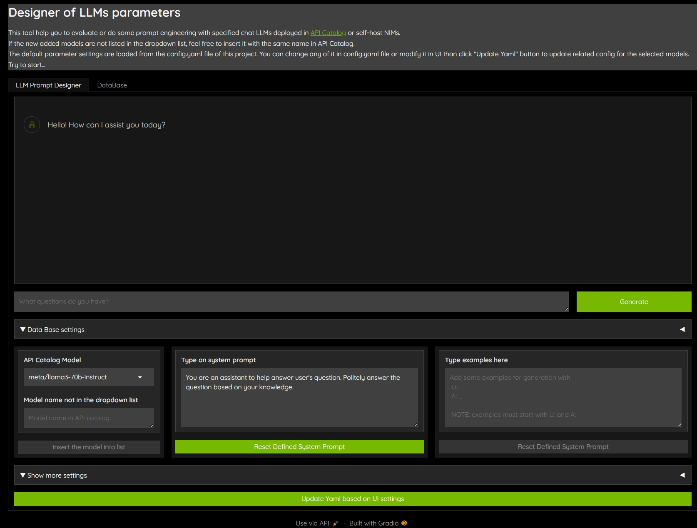
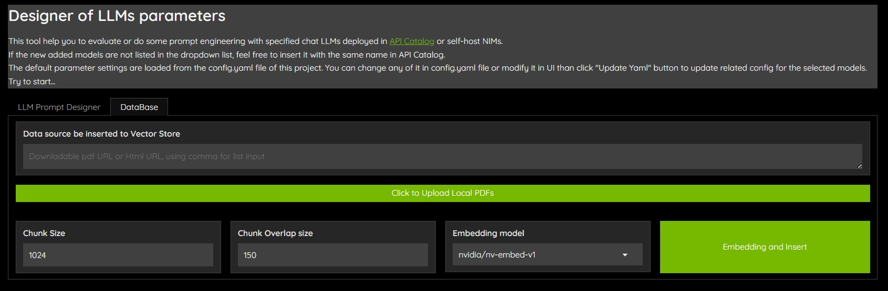
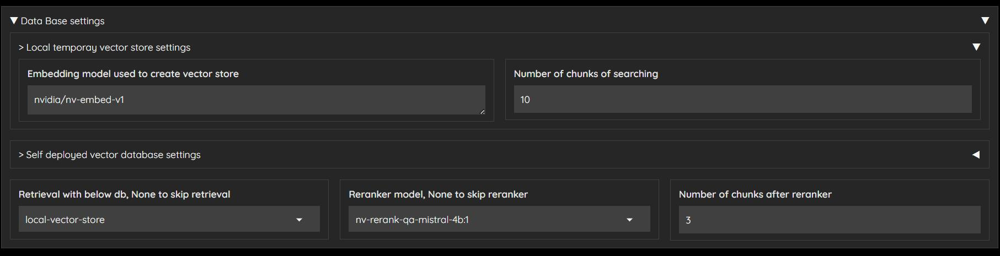
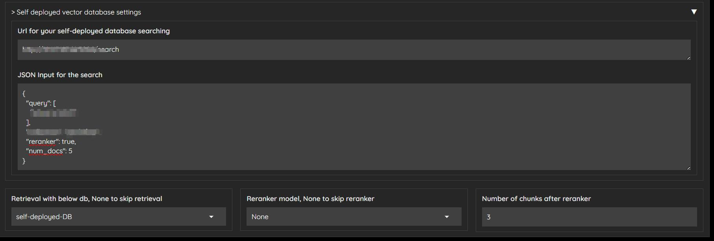

# guide_to_integrate_api_catalog

This project is used to create a simple UI to interact with selectable NIM endpoints (see below supported endpoints) and integrate RAG pipeline.

- [API catalog](https://build.nvidia.com/explore/discover) hold by NVIDIA.
- Self-host NIM
- HuggingFace NIM


## Target Users
This project targets to help developers who:
- Want to evaluate different NIM LLMs with small or large dataset.
- Need to tune parameters, such as temperature, top_p, etc.
- Need to do prompt engineering, such as system prompt, few shot examples, etc.
- Need to design some simple agents based on prompt engineering.
- Want to integrate with RAG pipeline to evaluate the designed system prompt.

## System prompt helper



The provided interface of this project supports designing a system prompt to call the LLM. The system prompt is configured in the `config.yaml` file using the model name as the key, e.g., `"meta/llama3-70b-instruct"`. You can also add few-shot examples in the `config.yaml` file (there are some commented lines for description) or via the UI in a defined format for your typical use case.

For development purposes, developers can use this interface to design the system prompt interactively. After selecting the model, you can input a new system prompt, which will overwrite the system prompt in `config.yaml`. If the system prompt is defined, you can configure it for the related model in `config.yaml` by clicking `Update Yaml based on UI settings` button. 

The interface will automatically load the selected model's conguration from `config.yaml` and display it in the UI. Additionally, it will list available chat models from the API catalog via `langchain-nvidia-ai-endpoints` in a dropdown menu. To see the list from the API catalog, you need to set the API key by following the instructions in the next section. If new models are not available via the endpoints or you want to test with self-hosted or Hugging Face NIMs endpoints, you can manually insert the model via the UI textbox (Input the name under `Model name in API catalog`, then click `Insert the model into list` button)

Note: To insert models deployed in API catalog, pls using the same name as defined in the API catalog.

## Integrate with RAG pipeline


This tool provides two methods to integrate with the RAG pipeline:
1. Generate a temporary vector store for retrieval.
2. Interact with a self-hosted retrieval engine that provides an endpoint for retrieval.

### Temporary vector store
This tool supports inserting website HTML links, downloadable PDF links, and uploading PDFs from local storage. 

By clicking the **DataBase** tab in the UI, you can input website links or downloadable PDF links, using commas to separate multiple entries. You can also upload PDFs by clicking the `Click to Upload Local PDFs` button. Once the data sources are prepared, you can set the chunk size, chunk overlap size, and select one of the embedder models in [NVIDIA　API catalog](https://build.nvidia.com/explore/retrieval). By clicking `Embedding and Insert`, the content will be parsed, embedded, and inserted into a temporary vector store.

With this vector store set up, go back to the **LLM Prompt Designer** tab and expand the `Data Base settings`. The retrieval settings will be available. You can then select one of the Reranker models for the RAG pipeline, which are available in [NVIDIA　API catalog](https://build.nvidia.com/explore/retrieval).



### Self-deployed retrieval engine
This tool also supports interacting with self-hosted retrieval engine which provided an endpoint for retrieval. 

Expand the `Data Base settings` -> `Self deployed vector database settings` in **LLM Prompt Designer** tab, input the engine endpoint, and query format string, using `{input}` as format query input. The retrieval database selection of `self-deployed-db` will be available. You can then select one of the Reranker models which are available in [NVIDIA　API catalog](https://build.nvidia.com/explore/retrieval) for the RAG pipeline or disable reranker by selecting `None`.



## Getting started
### Prepare the docker image
Run below command to build the docker image
```bash
git clone https://github.com/NVIDIA/GenerativeAIExamples/ && cd GenerativeAIExamples/community/llm-prompt-design-helper
bash ./build_image.sh
```

### Start the project
#### API catalog NIM endpoints
Set the API key env before start the container. 

```bash
export API_CATALOG_KEY="nvapi-*******************"
export NIM_INFER_URL="https://integrate.api.nvidia.com/v1"
```

If you don't have an API key, follow [these instructions](https://github.com/NVIDIA/GenerativeAIExamples/blob/main/docs/api-catalog.md#get-an-api-key-for-the-accessing-models-on-the-api-catalog) to sign up for an NVIDIA AI Foundation developer account and obtain access.

Run below command to run the container.
```bash
bash ./run_container.sh
```

#### Self-host NIM endpoints
If you already have access to self-host NIM, you can follow the [guide](https://docs.nvidia.com/nim/large-language-models/latest/introduction.html) to set up the NIM.

To inference via this UI, follow this [run inference](https://docs.nvidia.com/nim/large-language-models/latest/getting-started.html#openai-completion-request) guide to get the base_url and api_key. Then run below command to set the environment. 

```bash
export API_CATALOG_KEY="not-used"
export NIM_INFER_URL="http://0.0.0.0:8000/v1"
```

Run below command to run the container.
```bash
bash ./run_container.sh
```

NOTE: 
1. If you have different models deployed with different IP, you can set the env once, and using UI -> Show more settings -> input your different IP and port like "http://{IP}:{PORT}/v1"
2. The **Insert model mannually** feature will be disabled when inference with self-host NIM endpoint

#### Hugging Face NIM endpoints
NVIDIA have already collaboration with Hugging Face to simplify generative AI model deployments, you can follow this [technical blog](https://developer.nvidia.com/blog/nvidia-collaborates-with-hugging-face-to-simplify-generative-ai-model-deployments/) to deploy the NIM in Hugging Face. After the deployment, you can also interact with the NIM endpoints via this project. 

To inference via this UI, get the base_url and api_key of Hugging Face. Then run below command to set the environment. 
```bash
export API_CATALOG_KEY="hf_xxxx"
export NIM_INFER_URL="{hugging face inference URL}"
```

Run below command to run the container.
```bash
bash ./run_container.sh
```
NOTE: 
1. The **Insert model mannually** feature will be disabled when inference with Hugging Face NIM endpoint

### Access the UI
After service starts up, you can open the UI via http://localhost:80/ 

## Test with dataset
If you want to test with a local dataset when the config.yaml is finalized, then you can load your test set and run the inference with the configuration to test. The sample scripts can refer [`test.py`](./test.py).

### Demo
To update the application port number instead of default 80, do following:
- Update the port number in `chat_ui.py` line `UI_SERVER_PORT = int(os.getenv("UI_SERVER_PORT", 80))` 
- Update the port number in `run_container.sh` line `docker run -d -p80:80 ***` 

See the demo 

## Contributing

Please create a merge request to this repository, our team appreciates any and all contributions that add features! We will review and get back as soon as possible.


