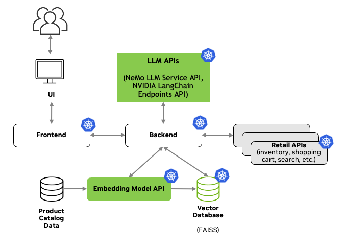

# NVIDIA Retail Product Advisor AI Workflow

LLMs and GenAI provide an incredible opportunity for Retailers to:
* Empower and augment employees and help them better understand products,
* Reduce costs of customer assistance, and
* Provide a delightful customer experience.

In the NVIDIA Retail Product Advisor AI Workflow, we'll show how to develop an LLM-powered RAG application that can ingest product catalog data, reason about how to respond or which tools to use, as well as retrieve appropriate products and answer questions about them.

### Architecture

<p align="center">
  
</p>

<table class="tg">
<thead>
  <tr>
    <th class="tg-6ydv">Response LLM</th>
    <th class="tg-6ydv">Function Calling LLM</th>
    <th class="tg-6ydv">Embedding</th>
    <th class="tg-6ydv">Framework</th>
    <th class="tg-6ydv">Description</th>
    <th class="tg-6ydv">Multi-GPU</th>
    <th class="tg-6ydv">TRT-LLM</th>
    <th class="tg-6ydv">NVIDIA AI Foundation</th>
    <th class="tg-6ydv">Triton</th>
    <th class="tg-6ydv">Vector Database</th>
  </tr>
</thead>
<tbody>
  <tr>
    <td class="tg-knyo">mixtral_8x7b</td>
    <td class="tg-knyo">gpt-3.5-turbo-1106</td>
    <td class="tg-knyo">nvolveqa_40k</td>
    <td class="tg-knyo">Langchain</td>
    <td class="tg-knyo">Product Advisor</td>
    <td class="tg-knyo">NO</td>
    <td class="tg-knyo">NO</td>
    <td class="tg-knyo">NO</td>
    <td class="tg-knyo">NO</td>
    <td class="tg-knyo">FAISS</td>
  </tr>
</tbody>
</table>


### Data

Put your data in the `data` folder as a CSV file. It should have the following columns:

```
category,subcategory,name,description,url,price,image
```

### Setting up the backend

Set the following environment variables:

```bash
export NGC_CLI_API_KEY=...
export NVIDIA_API_KEY=...
export OPENAI_API_KEY=...
```

You can find your [NGC_CLI_API_KEY here](https://ngc.nvidia.com/setup/api-key), your [NVIDIA_API_KEY here](https://catalog.ngc.nvidia.com/orgs/nvidia/teams/ai-foundation/models/mixtral-8x7b/api), and [your OPENAI_API_KEY here](https://platform.openai.com/account/api-keys).

Run backend application:

```bash
docker-compose build chatbot-service

docker-compose up -d chatbot-service

# Inspect logs
docker-compose logs -f chatbot-service
```

Access the OpenAPI documentation at: http://localhost:5001/docs#/

### Setting up the frontend

Run frontend application:

```bash
cd frontend-service
npm install
cd ..

docker-compose build frontend-service

docker-compose up -d frontend-service

# Inspect logs
docker-compose logs -f chatbot-service

# Or navigate to `./frontend-service` and run:
npm run start
```

Then navigate to [http://localhost:3000](http://localhost:3000).

### Running the notebooks

Run Jupyter lab service:

```bash
docker-compose build lab-service

docker-compose up -d lab-service

# Inspect logs
docker-compose logs -f lab-service
```

### Examples

Below, we demonstrate sending a request to the deployed backend:

```bash
curl -X 'POST' \
  'http://127.0.0.1:5001/chat' \
  -H 'accept: application/json' \
  -H 'Content-Type: application/json' \
  -d '[
  {
    "role": "system",
    "content": "You are an AI chatbot that helps customers answer questions about products."
  }, 
  {
    "role": "user",
    "content": "Can help me find a coffee mug?"
  }
]'
```

And we receive the response with 2 products as a result of `search`:

```bash
{
  "messages": [
    {
      "role": "system",
      "content": "You are an AI chatbot that helps customers answer questions about products."
    },
    {
      "role": "user",
      "content": "Can help me find a coffee mug?"
    },
    {
      "role": "assistant",
      "content": "Sure, I'd be happy to help you find a coffee mug! Here are two options that you might like:\n\n1. 14 OZ. NVIDIA LOGO MUG: This mug features a barrel design, large handle, matte exterior finish, and gloss colored interior. It holds 14 oz. and is microwave safe. Hand wash is recommended. The price is $7.50 and it has a rating of 4.53. You can find it here: <https://gear.nvidia.com/14-oz-NVIDIA-Logo-Mug-P228.aspx>\n2. 14 OZ. VISUAL PURR-CEPTION MUG: This mug is inspired by NVIDIA Engineer Robert Bond and features a cute cat design. It also holds 14 oz. and is microwave safe. However, please note that it cannot be shipped to APAC. Hand wash is recommended. The price is $12.00 and it has a rating of 4.54. You can find it here: <https://gear.nvidia.com/14-oz-Visual-Purr-Ception-Mug-P614.aspx>\n\nLet me know if you have any questions or if there's anything else I can help you with!"
    }
  ],
  "products": [
    {
      "name": "14 OZ. NVIDIA LOGO MUG",
      "description": "14 oz. ceramic mug features a barrel design, large handle, matte exterior finish and gloss colored interior.\n\nProduct Details: \n\n3-5/8\" H x 3-5/8 (5 w/handle)\"\nHand wash recommended \nMicrowave safe",
      "url": "https://gear.nvidia.com/14-oz-NVIDIA-Logo-Mug-P228.aspx",
      "price": 7.5,
      "image": "https://gear.nvidia.com/GetImage.ashx?Path=%7e%2fAssets%2fNV00-0165-LIM_2.jpg&maintainAspectRatio=true&width=800",
      "ratings": [
        5,
        ...,
        5
      ]
    },
    {
      "name": "14 OZ. VISUAL PURR-CEPTION MUG",
      "description": "Everyone loves cats. Keep an eye on those felines with this 14 oz. deep learning mug inspired by NVIDIA Engineer Robert Bond.\n\nProduct Details: \n\n3-5/8\" H x 3-5/8 (5 w/handle)\"\nHand wash recommended\nMicrowave safe\nCannot be shipped to APAC",
      "url": "https://gear.nvidia.com/14-oz-Visual-Purr-Ception-Mug-P614.aspx",
      "price": 12,
      "image": "https://gear.nvidia.com/GetImage.ashx?Path=%7e%2fAssets%2fProductImages%2fNV00-0489-LIM_Full.jpg&maintainAspectRatio=true&width=800",
      "ratings": [
        4,
        ...,
        5
      ]
    }
  ],
  "fn_metadata": {
    "fn_name": "search",
    "fn_args": {
      "query": "coffee mug"
    }
  }
}
```
