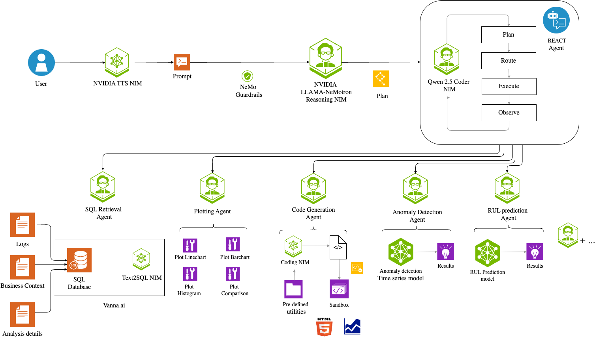
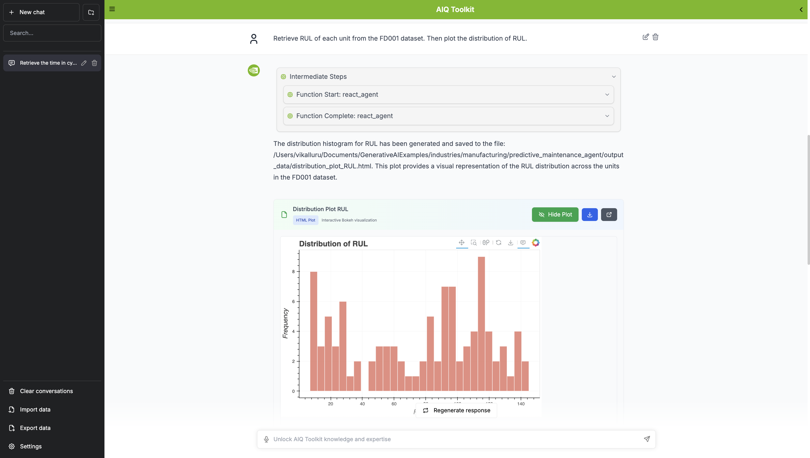
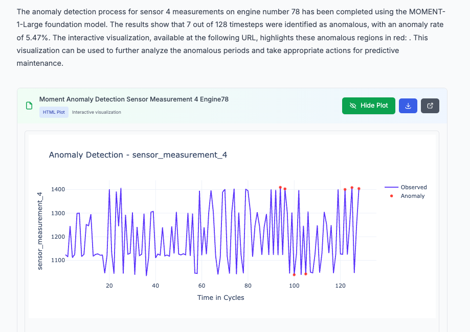

# Asset Lifecycle Management Agent

An AI-powered system for managing industrial assets throughout their lifecycle, built with NeMo Agent Toolkit. Currently focused on predictive maintenance for turbofan engines with plans to expand to full lifecycle management.

Work done by: Vineeth Kalluru, Janaki Vamaraju, Sugandha Sharma, Ze Yang, and Viraj Modak

## Overview

Asset Lifecycle Management (ALM) spans acquisition, operation, upgrades, and retirement of industrial assets. This project delivers an agentic workflow that applies ALM ideas to real data. Today it focuses on the operation and maintenance slice: using time‑series sensor data to predict remaining useful life (RUL), detect anomalies, and recommend next steps. We use the NASA C‑MAPSS turbofan dataset as a practical, well‑studied benchmark with realistic signals and run‑to‑failure trajectories. The system is modular and backed by SQL (SQLite by default, PostgreSQL/MySQL supported), so extending into planning, commissioning, optimization, and decommissioning is straightforward as additional tools and integrations are added.

## Dataset

Uses the **NASA Turbofan Engine Degradation Simulation Dataset (C-MAPSS)** with:
- **21 Sensor Measurements**: Temperature, pressure, vibration, and flow
- **3 Operational Settings**: Different flight conditions
- **Multiple Engine Units**: Each with unique degradation patterns
- **Run-to-Failure Data**: Complete lifecycle from healthy operation to failure

## Architecture

Multi-agent architecture designed for Asset Lifecycle Management with specialized tools for the Operation & Maintenance phase:
- **ReAct Agent Workflow**: Main orchestration using ReAct pattern for intelligent decision-making
- **SQL Retriever Tool**: Generates SQL queries using NIM LLM for asset data retrieval
- **RUL Prediction Tool**: XGBoost model for remaining useful life prediction to optimize maintenance scheduling
- **Anomaly Detection Tool**: Detects anomalies in sensor data using time series foundational model for early failure detection
- **Plotting Agents**: Multi-tool agent for data visualization and asset performance reporting
- **Vector Database**: ChromaDB for storing table schema, Vanna training queries, and asset documentation

This architecture provides the foundation for comprehensive asset health monitoring, enabling data-driven maintenance decisions and extending asset operational life.

#### Agentic workflow architecture diagram w/ reasoning


## Setup and Installation

> 📖 **For detailed installation instructions including database setup (PostgreSQL, MySQL, SQLite) and vector store configuration (ChromaDB, Elasticsearch), see [INSTALLATION.md](INSTALLATION.md)**

### Prerequisites
- Python 3.11+ (< 3.13)
- Conda or Miniconda
- NVIDIA NIM API access
- Node.js v18+ (for web interface)

### Hardware Requirements

**CPU:**
- Minimum: 8 cores, 16GB RAM

**GPU:**

| Model Name                              | Minimum GPU Requirement         |
|------------------------------------------|---------------------------------|
| qwen/qwen2.5-coder-32b-instruct          | 2×A100 or 1×H100                |
| nvidia/llama-3.3-nemotron-super-49b-v1   | 2×A100 or 1×H100                |
| nvidia/llama-3.1-nemotron-nano-vl-8b-v1  | 1×A100 or 1×H100                |
| nvidia/nv-embed-v1                       | 1×L40s or 1×A100                |

- GPU is **not required** if you are using NVIDIA NIM cloud APIs.
- For local deployment, the table above lists the minimum recommended GPUs for each model.
- For most applications, a system with 8×A100 or 4×H100 GPUs will be more than sufficient (application sizing is still being finalized).

**Operating System:**
- Linux (Ubuntu 20.04+ recommended)
- macOS (Intel or Apple Silicon) - Tested on MAC M2 Pro 32GB RAM
- Windows 10/11 with WSL2

**Storage:**
- **Base Installation**: 250MB (includes database, MOMENT library, and source code)
- **NASA Dataset**: ~50-100MB (when downloaded from Kaggle)
- **Working Space**: 500MB-1GB (for logs, additional outputs, temporary files)
- **Recommended Total**: 2-3GB free space for comfortable operation
**Approximate Memory Requirements for Local Model Storage (if not using NVIDIA endpoints):**

| Model Name                              | Approx. Memory Requirement (BF16) |
|-----------------------------------------|-----------------------------------|
| qwen/qwen2.5-coder-32b-instruct         | 64 GB                             |
| nvidia/llama-3.3-nemotron-super-49b-v1  | 98 GB                             |
| nvidia/llama-3.1-nemotron-nano-vl-8b-v1 | 16 GB                             |
| nvidia/nv-embed-v1                      | ~14 GB                            |

### 1. Create Conda Environment

```bash
conda create -n alm python=3.11
conda activate alm
```

### 2. Install NVIDIA NeMo Agent Toolkit

1. Clone the NeMo Agent Toolkit repository version 1.2.1 to your local machine:
   ```bash
   git clone --branch v1.2.1 https://github.com/NVIDIA/NeMo-Agent-Toolkit.git nat-toolkit
   cd nat-toolkit
   ```

2. Initialize, fetch, and update submodules in the Git repository:
   ```bash
   git submodule update --init --recursive
   ```

3. Fetch the datasets by downloading the LFS files:
   ```bash
   git lfs install
   git lfs fetch
   git lfs pull
   ```
4. Install the NeMo Agent Toolkit library:
   To install the NeMo Agent Toolkit library along with all optional dependencies, including developer tools (`--all-groups`) and all dependencies needed for profiling and plugins (`--all-extras`) in the source repository, run the following:
   ```bash
   uv sync --all-groups --all-extras
   ```

5. Install telemetry plugins:
   ```bash
   uv pip install -e '.[telemetry]'
   ```

### 3. Install Asset Lifecycle Management Agent

First, clone the GenerativeAIExamples repository inside the parent folder of NeMo-Agent-Toolkit and navigate to the Asset Lifecycle Management Agent folder:

```bash
git clone https://github.com/NVIDIA/GenerativeAIExamples.git
cd GenerativeAIExamples/industries/manufacturing/asset_lifecycle_management_agent
```

Clone the MOMENT library from GitHub inside this Asset Lifecycle Management Agent folder. 
This library is required to perform inference with MOMENT-1 time series foundational models for anomaly detection tasks during the Operation & Maintenance phase. More about it [here](https://huggingface.co/AutonLab/MOMENT-1-small).

```bash
git clone https://github.com/moment-timeseries-foundation-model/moment.git
```

Change the pyproject.toml file inside the cloned library: 

```bash
cd moment
vi pyproject.toml
```

Change the NumPy and Transformers dependencies:

```bash
...
dependencies = [
  "huggingface-hub==0.24.0",
  "numpy==1.25.2", # -->  to "numpy==1.26.2"
  "torch~=2.0",
  "transformers==4.33.3", # --> to "transformers>=4.33.3,<5.0.0"
]
...
```

Go back to the Asset Lifecycle Management Agent folder:

```bash
cd ..
```

Change the path to the cloned MOMENT library in `/path/to/asset_lifecycle_management_agent/pyproject.toml` if necessary.

Change it from:
```bash
[tool.uv.sources]
momentfm = { path = "/Users/vikalluru/Documents/GenerativeAIExamples/industries/manufacturing/asset_lifecycle_management_agent/moment", editable = true }
```
to:
```bash
[tool.uv.sources]
momentfm = { path = "/your/path/to/asset_lifecycle_management_agent/moment", editable = true }
```

This ensures that the MOMENT library will be installed from our cloned version instead of the PyPI release. 
Now install the ALM workflow:

```bash
uv pip install -e .
```

#### Installation Options

**Base Installation** (default - includes ChromaDB + SQLite):
```bash
uv pip install -e .
```

**Optional Database Support:**
- PostgreSQL: `uv pip install -e ".[postgres]"`
- MySQL: `uv pip install -e ".[mysql]"`
- All databases: `uv pip install -e ".[all-databases]"`

**Optional Vector Store:**
- Elasticsearch: `uv pip install -e ".[elasticsearch]"`

### [Optional] Verify if all prerequisite packages are installed
```bash
uv pip list | grep -E "nvidia-nat|nvidia-nat-ragaai|nvidia-nat-phoenix|vanna|chromadb|xgboost|pytest|torch|matplotlib"
```

### 4. Database Setup

1. Download the [NASA Turbofan Dataset](https://www.kaggle.com/datasets/behrad3d/nasa-cmaps)
2. Extract files to the `data/` directory
3. Run the setup script:
```bash
python setup_database.py
```

### 5. Configure Paths

**Important**: You need to replace the absolute path `/Users/vikalluru/Documents/GenerativeAIExamples/industries/manufacturing/asset_lifecycle_management_agent/` with your preferred workspace path in the following files:

1. **`configs/config-reasoning.yml`** - Update the `db_path` and `output_folder` paths
2. **`pyproject.toml`** - Update the MOMENT library path (if you changed it in step 3)

For example, if your workspace is at `/home/user/my_workspace/`, you would replace:
- `/Users/vikalluru/Documents/GenerativeAIExamples/industries/manufacturing/asset_lifecycle_management_agent/` 
- with `/home/user/my_workspace/`

**Note**: All other paths in the config file can be provided as relative paths from your workspace directory. Only the MOMENT library path in `pyproject.toml` needs to be an absolute path.

The `db_path` should point to the database inside your data directory:
```yaml
db_path: "data/nasa_turbo.db"
```

#### Output Folder Configuration

Create an empty folder for the output data and configure the `output_folder` path. You have two options:

**Option 1: Relative Path (Recommended)**
```yaml
output_folder: "output_data"
```
- Path is relative to where you run the workflow
- **Recommended**: Always run the workflow from the `asset_lifecycle_management_agent/` directory
- Creates `output_data/` folder in your project directory

**Option 2: Absolute Path**
```yaml
output_folder: "/absolute/path/to/your/output_data"
```
- Works regardless of where you run the workflow from
- Provides consistent output location

**Best Practice**: We recommend using relative paths and always running the workflow from the `asset_lifecycle_management_agent/` directory:

```bash
cd /path/to/GenerativeAIExamples/industries/manufacturing/asset_lifecycle_management_agent/
# Run all workflow commands from here
nat serve --config_file=configs/config-reasoning.yml
```

This ensures that:
- All relative paths work correctly
- Output files are organized within your project
- Configuration remains portable across different machines

#### Setting Up Workspace Utilities

**IMPORTANT**: The code generation assistant requires a `utils` folder inside your `output_data` directory for RUL transformation tasks.

**Setup Instructions:**

1. Create the output_data directory (if it doesn't exist):
```bash
mkdir -p output_data
```

2. Copy the pre-built utility functions from the template:
```bash
cp -r utils_template output_data/utils
```

3. Verify the setup:
```bash
ls output_data/utils/
# You should see: __init__.py  rul_utils.py
```

**What's included:**
- `apply_piecewise_rul_transformation(df, maxlife=100)` - Transforms RUL data to create realistic "knee" patterns
- `show_utilities()` - Display available utility functions

These utilities are automatically available to the code generation assistant when running in the Docker sandbox (mapped as `/workspace/utils/`). The system will only import these utilities when specifically needed for RUL transformations, preventing unnecessary module loading errors (`ModuleNotFoundError: No module named 'utils'` will not occur).

**How It Works:**
- When you start the sandbox with `output_data/` as the mount point, the `utils/` folder becomes accessible at `/workspace/utils/`
- The code generation assistant only imports utils when performing RUL transformations
- For regular tasks (data retrieval, plotting, etc.), utils are not imported, avoiding module errors

**Note**: If you move your `output_data` folder, make sure the `utils` subfolder comes with it, or copy it from `utils_template` again.

### 6. Vanna SQL Agent Training (Automatic)

**Important**: The Vanna SQL agent training happens automatically when you start the workflow server. The `vanna_training_data.yaml` file contains pre-configured domain-specific knowledge that will be loaded automatically during server startup.

This training data includes:
- **Synthetic DDL statements**: Table schemas for all NASA turbofan datasets
- **Domain documentation**: Detailed explanations of database structure and query patterns
- **Example queries**: Common SQL patterns for turbofan data analysis
- **Question-SQL pairs**: Natural language to SQL mappings

The automatic training helps the SQL agent understand:
- How to distinguish between training, test, and RUL tables
- Proper handling of remaining useful life calculations
- Domain-specific terminology and query patterns
- Table relationships and data structure

Training configuration is specified in `configs/config-reasoning.yml`:
```yaml
vanna_training_data_path: "vanna_training_data.yaml"
```

**Note**: If you modify your database structure or add new query patterns, update the `vanna_training_data.yaml` file accordingly to maintain optimal SQL generation performance.

### 7. Set Environment Variables

Set the required environment variables for the workflow:

1. Create a `.env` file from the template and update it with your actual values:
   ```bash
   cp env_template.txt .env
   ```
   
   Then edit the `.env` file and replace the placeholder values with your actual keys:
   ```bash
   # Replace the placeholder values with your actual keys
   NVIDIA_API_KEY="your-actual-nvidia-api-key"
   CATALYST_ACCESS_KEY="your-actual-catalyst-access-key"  # Optional
   CATALYST_SECRET_KEY="your-actual-catalyst-secret-key"  # Optional
   ```

2. Source the file to export the variables:
   ```bash
   source .env
   ```

**Note**: The `env_template.txt` file contains placeholder values. Copy it to `.env` and replace them with your actual API keys before sourcing the file.

Verify that the NVIDIA API key is set:

```bash
echo $NVIDIA_API_KEY
```

## Launch Server and UI

### Start FastAPI Server

With other frameworks like LangGraph or CrewAI, users are expected to develop a FastAPI server to interact with their agentic workflow. Fortunately, NeMo Agent Toolkit offers this out of the box with the simple `nat serve --config_file <path-to-file>` command.

Start the server now:

```bash
nat serve --config_file=configs/config-reasoning.yml
```

You should see something like this, which indicates that the server started successfully:

```bash
...
...
INFO:     Application startup complete.
INFO:     Uvicorn running on http://localhost:8000 (Press CTRL+C to quit)
```

During startup, you'll see Vanna training logs as the SQL agent automatically loads the domain knowledge from `vanna_training_data.yaml` (as described in Section 6).

### Start Modern Web UI (Recommended)

We now provide a **custom modern web interface** inspired by the NVIDIA AIQ Research Assistant design! This UI offers a superior experience for Asset Lifecycle Management workflows compared to the generic NeMo-Agent-Toolkit-UI.

**In a new terminal**, navigate to the frontend directory and start the UI:

```bash
cd frontend
npm install  # First time only
npm start
```

The UI will be available at `http://localhost:3000`

**Features of the Modern UI:**
- 🎨 Clean, professional NVIDIA-branded design
- 📊 Embedded visualization display for plots and charts
- 🎯 Quick-start example prompts for common queries
- ⚙️ Configurable settings panel
- 🌓 Dark/Light theme support
- 📱 Fully responsive mobile design
- 🔄 Real-time streaming responses

See `frontend/README.md` for detailed documentation.

### Start Code Execution Sandbox

The code generation assistant requires a standalone Python sandbox that can execute the generated code. This step starts that sandbox.

Note: You will need a system that can run Docker. If you are running this on a macOS laptop without Docker Desktop, try [Colima](https://github.com/abiosoft/colima).

Navigate to the NeMo Agent Toolkit code execution directory:

```bash
cd /path-to/NeMo-Agent-Toolkit/src/nat/tool/code_execution/
```

Start the sandbox by running the script with your output folder path:

```bash
./local_sandbox/start_local_sandbox.sh local-sandbox /path-to-output-folder-as-specified-in-config-yml/
```

For example:

```bash
./local_sandbox/start_local_sandbox.sh local-sandbox /path-to/GenerativeAIExamples/industries/manufacturing/asset_lifecycle_management_agent/output_data/
```

[Optional] Verify the sandbox is running correctly:

```bash
# Test code execution (the main endpoint)
curl -X POST http://localhost:6000/execute \
  -H 'Content-Type: application/json' \
  -d '{"generated_code": "print(\"Hello from sandbox!\")", "timeout": 10, "language": "python"}'
```

To stop the sandbox when you're done, stop the Docker container:

```bash
docker stop local-sandbox
```

## Workspace Utilities

The Asset Lifecycle Management Agent includes a powerful **workspace utilities system** that provides pre-built, reliable functions for common data processing tasks. This eliminates the need for the code generation assistant to implement complex algorithms from scratch, resulting in more reliable and consistent results.

### How Workspace Utilities Work

The utilities are located in `/workspace/utils/` (which maps to your `output_data/utils/` directory). Instead of asking the LLM to generate complex transformation code through multiple agent layers (which can lose context and introduce errors), this system provides pre-tested utility functions that can be invoked with simple instructions.

**Architecture Benefits**:
- **Reliability**: Pre-tested, robust implementations instead of generated code
- **Consistency**: Same results every time, no variation in algorithm implementation
- **Simplicity**: Reasoning agent just needs to specify "use RUL utility" instead of detailed pseudo-code
- **Error Handling**: Comprehensive validation and user-friendly error messages
- **In-Place Operations**: Files are modified directly, avoiding unnecessary copies

### Available Utilities

#### RUL Transformation Utilities

**`apply_piecewise_rul_transformation(file_path, maxlife=100)`**
- Transforms RUL data to create realistic "knee" patterns
- **Input**: JSON file with engine time series data
- **Output**: pandas DataFrame with original data plus new 'transformed_RUL' column (also saves file in-place)
- **Pattern**: RUL stays constant at `MAXLIFE` until remaining cycles drop below threshold, then decreases linearly to 0
- **Use case**: Creating realistic RUL patterns for comparison with predicted values

### Usage in Workflows

**For Users**: When interacting with the system, you can request complex data transformations knowing that reliable utilities will handle the implementation. For example:

```
"Transform the actual RUL data for engine 24 to piecewise representation with MAXLIFE=100"
```

**For Developers**: The code generation assistant automatically uses these utilities when available. The system prompts include instructions to:
1. Check if a task can be accomplished using workspace utilities
2. Import utilities with proper path setup
3. Use utilities instead of custom implementations

### Example Workflow

1. **User Request**: "Compare actual vs predicted RUL for engine unit 24"
2. **System Process**:
   - Retrieves ground truth data from database
   - Predicts RUL using the model
   - **Uses utility**: `utils.apply_piecewise_rul_transformation(data_file, maxlife=100)` (returns DataFrame)
   - Generates comparison visualization
3. **Result**: Clean, reliable transformation with consistent knee pattern

### Adding Custom Utilities

You can extend the utilities by adding new functions to `/output_data/utils/`:

1. **Create your utility function** in `utils/` directory
2. **Import it** in `utils/__init__.py`
3. **Document it** in the help system
4. **Update system prompts** if needed (optional)

**Example utility structure**:
```python
def your_custom_utility(file_path: str, param: int = 100) -> str:
    """
    Your custom utility function.
    
    Args:
        file_path: Path to input file
        param: Your parameter
        
    Returns:
        Success message with details
    """
    # Implementation with error handling
    # ...
    return "✅ Custom utility executed successfully!"
```

### Best Practices

1. **Prefer Utilities**: Always check if existing utilities can handle your task
2. **Error Handling**: Utilities include comprehensive validation - no need to duplicate
3. **In-Place Operations**: Utilities modify files directly, avoiding data duplication
4. **Consistent Interface**: All utilities return descriptive success messages
5. **Documentation**: Use `utils.show_utilities()` to discover available functions

### Alternative: Generic NeMo-Agent-Toolkit UI

If you prefer the generic NeMo Agent Toolkit UI instead of our custom interface:

```bash
git clone https://github.com/NVIDIA/NeMo-Agent-Toolkit-UI.git
cd NeMo-Agent-Toolkit-UI
npm ci
npm run dev
```
The UI is available at `http://localhost:3000`

**Configure UI Settings:**
- Click the Settings icon (bottom left)
- Set HTTP URL to `/chat/stream` (recommended)
- Configure theme and WebSocket URL as needed
- Check "Enable intermediate results" and "Enable intermediate results by default" if you prefer to see all agent calls while the workflow runs

**Note:** The custom modern UI (described above) provides better visualization embedding, domain-specific examples, and a more polished experience tailored for Asset Lifecycle Management workflows.

## Example Prompts

Test the system with these prompts:

**Data Retrieval:**
```
Retrieve the time in cycles and operational setting 1 from the FD001 test table for unit number 1 and plot its value vs time.
```


**Visualization:**
```
Retrieve real RUL of each unit in the FD001 test dataset. Then plot a distribution of it.
```




**Anomaly Detection**
```
Retrieve and detect anomalies in sensor 4 measurements for engine number 78 in train FD001 dataset.
```



**Workspace Utilities Demo**
```
Retrieve RUL values and time in cycles for engine unit 24 from FD001 train dataset. Use the piece wise RUL transformation code utility to perform piecewise RUL transformation on the ground truth RUL values with MAXLIFE=100.Finally, Plot a comparison line chart with RUL values and its transformed values across time.
```

*This example demonstrates how to discover and use workspace utilities directly. The system will show available utilities and then apply the RUL transformation using the pre-built, reliable utility functions.*

**Prediction and Comparison (Uses Workspace Utilities)**
```
Perform the following steps:

1.Retrieve the time in cycles, all sensor measurements, and ground truth RUL values, partition by unit number for engine unit 24 from FD001 train dataset.
2.Use the retrieved data to predict the Remaining Useful Life (RUL). 
3.Use the piece wise RUL transformation code utility to apply piecewise RUL transformation only to the observed RUL column with MAXLIFE of 100.
4.Generate a plot that compares the transformed RUL values and the predicted RUL values across time.
```


*Note: This example automatically uses the workspace `apply_piecewise_rul_transformation` utility to create realistic knee-pattern RUL data for comparison, resulting in much cleaner and more meaningful visualizations.*

## Observability (Optional)

### Monitor Your System with Phoenix

Ensure that Phoenix tracing-related information is present in the config file.

Uncomment this portion of `asset_lifecycle_management_agent/configs/config-reasoning.yml` file:

```yaml
...
    # Uncomment this to enable tracing
    # tracing:
    #   phoenix:
    #     _type: phoenix
    #     endpoint: http://localhost:6006/v1/traces
    #     project: alm-test # You can replace this with your preferred project name
...
```

```bash
# Docker (recommended)
docker run -p 6006:6006 -p 4317:4317 arizephoenix/phoenix:latest

# Or install as package
uv pip install arize-phoenix
phoenix serve
```
Access the dashboard at `http://localhost:6006` to monitor traces, performance, and costs.

### Monitor Your System with Catalyst

Follow the instructions [here](https://github.com/NVIDIA/NeMo-Agent-Toolkit/blob/develop/docs/source/workflows/observe/observe-workflow-with-catalyst.md) to set up your RAGA AI profile.

Ensure you update the CATALYST-related environment variables in the `.env` file (uncomment and set the values) and source that file again:

```bash
CATALYST_ACCESS_KEY="xxxxxxxxxxxxxxxx" # Change this to your RAGA AI Access key
CATALYST_SECRET_KEY="xxxxxxxxxxxxxxxxxxxxxxxx" # Change this to your RAGA AI Secret key
CATALYST_ENDPOINT=https://catalyst.raga.ai/api # Don't change this
```

Uncomment this portion of `asset_lifecycle_management_agent/configs/config-reasoning.yml` file to enable Catalyst tracing:

```yaml
...
    # Uncomment this to enable tracing
    # tracing:
    #   catalyst:
    #     _type: catalyst
    #     project: "alm-test" # You can replace this with your preferred project name
    #     dataset: "alm-dataset" # You can replace this with your preferred dataset name
...
```

You should see Catalyst initialization-related information in the terminal when you launch the workflow server.

## [Optional] Testing the Workflow

NeMo Agent Toolkit provides the flexibility to run workflows not just through terminal commands (`nat serve`) but also programmatically in Python which helps in seamless CI/CD pipeline integration. 

You can test the workflow by running the `test_alm_workflow.py` file using pytest instead of starting the server, which provides a Pythonic way of building and running the workflow programmatically. This approach is particularly valuable for continuous integration and deployment systems, allowing automated validation of workflow components and streamlined deployment processes.

Ensure that you have set the `$NVIDIA_API_KEY` environment variable before running:

```bash
pytest test_alm_workflow.py -m e2e -v
```

To run individual tests in the file:

```bash
pytest test_alm_workflow.py -k "<test_name>" -v
```

## Evaluation

This example comes with 25 curated queries and reference answers that form our evaluation dataset. You can access this in the `eval_data/eval_set_master.json` file.

### Multimodal Evaluation with Vision-Language Models

We have implemented an innovative **Multimodal LLM Judge Evaluator** for agentic workflow evaluation, specifically designed for Asset Lifecycle Management tasks that generate both text and visual outputs.

**Why Custom Multimodal Evaluation?**

The built-in evaluators in NeMo Agent Toolkit have significant limitations:
- **Text-Only Evaluation**: Cannot assess visual outputs like plots and charts
- **Rigid String Matching**: Uses LangChain's `TrajectoryEvalChain` which only looks for exact patterns
- **No Visual Understanding**: Cannot evaluate whether generated plots match expected visualizations
- **Generic Prompts**: Not tailored for asset management and maintenance domain

**Our Innovative Multimodal Approach:**

**Vision-Language Model Evaluation** - Uses `nvidia/llama-3.1-nemotron-nano-vl-8b-v1` (VLM) to evaluate both text semantic correctness and visual plot accuracy in a unified evaluation framework.

**Key Innovation: Dual-Mode Intelligent Evaluation**
- **Text Evaluation Mode**: When no plots are present, evaluates semantic correctness of text responses
- **Visual Evaluation Mode**: When plot images are detected, automatically switches to visual analysis mode to assess plot accuracy against reference descriptions
- **Automatic Plot Detection**: System automatically discovers plot file paths in responses and includes actual plot images in the evaluation

**Advantages:**
- ✅ **Unified Multimodal Assessment**: Single VLM evaluates both text quality and visual accuracy
- ✅ **Intelligent Mode Switching**: Automatically detects whether to evaluate text or plots
- ✅ **Visual Understanding**: Can assess if generated plots show correct data patterns, axis labels, trends
- ✅ **Simple Scoring**: Supports only three scores from 0.0 (fully incorrect), 0.5 (partially correct) to 1.0 (fully correct)
- ✅ **Domain-Specific**: Tailored prompts for Asset Lifecycle Management and maintenance visualization patterns

We have created a smaller version of this dataset in `eval_data/eval_set_test.json` to help with quick checks before running the larger evaluation workflow.

### Evaluate with NAT 

Update the config file with the path to the evaluation set.

In `asset_lifecycle_management_agent/configs/config-reasoning.yml`:
```yaml
eval:
  general:
    output:
      dir: "eval_output"
      cleanup: true
    dataset:
      _type: json
      file_path: "eval_data/eval_set_master.json" # Path to eval dataset
    query_delay: 10  # Change this to increase delay between running queries, useful if your underlying API (like build.nvidia.com) has requests/second or rate limits
    max_concurrent: 1  # Change this to the number of eval set entries that should be processed concurrently. Keep it at 1 to ensure smooth execution
```

Now, run this command:

```bash
nat eval --config_file configs/config-reasoning.yml
```

You should see an `eval_output` folder generated in your working directory with `multimodal_eval_output.json`. We have provided you with an example output in `eval_output/example_multimodal_eval_output.json`.

### Model Performance Notes

Our evaluation results show that **GPT 4.1 mini model achieves higher accuracies** when used as the ReAct agent compared to other models. If you're looking to maximize evaluation performance, consider configuring GPT 4.1 mini as your reasoning agent in the workflow configuration.

Add this to the config file:
```
analyst_llm:
   _type: openai
   model_name: "gpt-4.1-mini"
```

## Known Issues

- **Rate Limiting**: When using hosted build.nvidia.com endpoints, you may receive `[429] Too Many Requests` errors. This happens because the agentic workflow can generate a high volume of requests in a short period, exceeding the service's rate limits. To avoid these errors, consider running models locally instead of relying on the hosted endpoints.

- **Code Generation Failures**: Sometimes the code generation assistant cannot generate correct code and reaches the maximum retry limit. In this case, you may see a workflow response like "I seem to have a problem." Try running the query again - we are actively working to improve the code generation assistant experience.

- **Poor Response Quality**: If you're not getting good responses with the provided LLMs:
  - First, switch the reasoning model if the generated plan appears incorrect
  - Then, swap the analyst LLM to a model that excels at both tool calling and instruction following
  - You typically won't need to replace the embedding model, SQL model, code generation model, or evaluation model.

- **Evaluation Benchmark**: The workflow currently achieves an `average_score` of 0.75 or above on the master evaluation dataset. We are actively working to improve this score toward 1.0.

## Next Steps

The Asset Lifecycle Management Agent provides a foundation for comprehensive industrial asset management. Planned enhancements include:

**Operation & Maintenance Phase:**
- Memory layer for context retention across maintenance sessions
- Parallel tool execution for faster responses
- Action recommendation agent for maintenance prioritization
- Real-time fault detection agent
- Integration with NVIDIA's NV-Tesseract foundation models for improved time-series accuracy
- Integration with NeMo Retriever for enhanced data source context

**Expanded ALM Capabilities:**
- **Planning & Acquisition**: Tools for asset specification analysis, vendor comparison, and TCO (Total Cost of Ownership) calculation
- **Deployment & Commissioning**: Integration with commissioning checklists, validation protocols, and asset registration systems
- **Upgrades & Optimization**: Performance benchmarking tools, upgrade recommendation engines, and ROI analysis
- **Decommissioning & Disposal**: End-of-life planning tools, environmental compliance tracking, and asset value recovery optimization

**Evaluation & Quality:**
- Expansion of evaluation dataset with complex queries involving advanced SQL queries like CTEs
- Additional evaluation metrics for ALM-specific tasks
---

**Resources:**
- [NeMo Agent Toolkit Documentation](https://docs.nvidia.com/nemo-agent-toolkit/)
- [Phoenix Observability](https://phoenix.arize.com/)
- [NV-Tesseract Models](https://developer.nvidia.com/blog/new-nvidia-nv-tesseract-time-series-models-advance-dataset-processing-and-anomaly-detection/)
