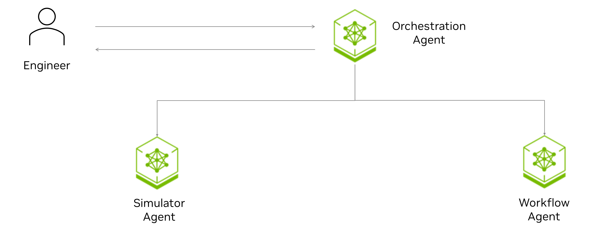

# Simulation Workflow Assistant
 
 
# Overview
 
Modern simulation workflows are often limited by the human throughput bottleneck. While high-performance computing and GPUs have accelerated physics engines, the surrounding processes—synthesizing data, troubleshooting convergence issues, and pivoting parameters—remain manual and linear. This creates significant **operational latency** and **"dead time"** during asynchronous execution.
 
This repository provides an **Agentic AI framework** designed to close this gap. It transitions the engineer from a manual executor to a strategic supervisor by offloading repetitive technical hurdles to a squad of specialized digital agents.
 
### Key Capabilities
* **Autonomous Reliability:** Agents monitor simulations in real-time to identify syntax errors or convergence issues, "self-healing" input decks to maintain 24/7 momentum.
* **Multi-Agent Orchestration:** Specialized agents (Proposers, Critics, and Analysts) autonomously refine strategies for simulation intensive workflows like optimization and uncertainty quantification.
* **Strategic Supervision:** Engineers maintain high-level control via an intent-based interface, reviewing and approving agent-proposed execution plans before deployment.
 
### Modular & Agnostic Architecture
The system is built to be extensible across tools and domains:
 
* **Simulation & Workflow Agnostic:** The agentic layer is decoupled from the physics engine. While demonstrated using an open-source simulation tool, it is designed to wrap around any industry-standard simulator and integrate with diverse workflow stacks.
* **Industry Agnostic:** The core logic of automating "dead time" and the "heuristic pause" is universal. The framework is readily extendable to any field reliant on iterative, complex simulations with minor modifications.

## Architecture

A central orchestration agent routes user queries to specialized sub-agents:

| Component | Purpose |
|-----------|---------|
| **Orchestration Agent** | Routes user queries to the appropriate sub-agent via LLM. Single entry point. |
| **Simulator Agent** | Conversational assistant: keywords, parsing, running cases, plotting, flow diagnostics. |
| **Workflow Agent** | Agentic optimization of simulation-intensive workflows: optimization, history matching, uncertainty quantification. |



### Extensibility & Reference Points (POC)

This repo serves as a reference for several patterns you can reuse or extend:

| Pattern | Location | Description | Benefit |
|---------|----------|-------------|---------|
| **Query decomposition** | `sim_agent/.../query_decomposition.py`, `TOOL_DECISION_TREE.md` | Structured routing via a decision tree; the LLM outputs JSON plans rather than relying solely on ReAct. Includes fallback heuristics when JSON parsing fails. | Single LLM call produces a plan; tools run deterministically—fewer calls than ReAct, faster response, lower cost, and better fit for smaller/cheaper models. |
| **Agent skills** | `sim_agent/.../skills/*/` | Modular skills with `SKILL.md`, tool auto-discovery, and `skill_loader`. Each skill is self-contained (scripts, references, assets). | Plug-and-play: add or remove skills without touching the agent core; easier to maintain, reuse, and share across projects. |
| **External tools as skills** | `sim_agent/.../skills/results_skill/` | Example of wrapping an external library ([pyflowdiagnostics](https://github.com/GEG-ETHZ/pyflowdiagnostics)) as an agent tool. Add your own skills with your own tools by following the same structure. | Integrate any library or CLI without changing the agent. |
| **Human-in-the-loop (HITL)** | `query_decomposition.py`, `runner.py` | Optional confirmation before modify/run/plot; configurable via `confirm_before_modify`, `confirm_before_run`, etc. | Safety and control for sensitive actions (e.g., modifying files, running simulations). Important for production and auditability. |

To add a new skill: create a folder under `sim_agent/src/simulator_agent/skills/` with `SKILL.md`, `scripts/` (tool implementations), and optionally `references/` and `assets/`. The skill loader discovers it automatically.

## Routing Examples

Typical queries and how they are routed:

| Query | Routes to |
|-------|-----------|
| What is the COMPDAT keyword format? | sim_agent |
| Can you run this case: `path/to/case/CASE.DATA` | sim_agent |
| Test a scenario with increased water injection rate of 12.0 at I1. Baseline: `path/to/case/CASE.DATA` | sim_agent |
| I am seeing early water breakthrough at P3 in `path/to/case/CASE.DATA`, help me understand why. | sim_agent |
| Run optimization with `path/to/config.yaml` | workflow_agent |


Example output:

```
Simulation Workflow Assistant — Interactive mode
Type your query and press Enter. Commands: 'quit' or 'exit' to stop.
------------------------------------------------------------

You: What is the COMPDAT keyword format?
[Orchestrator] Routing to sim_agent
--- Result ---
...

You: Run optimization on this case
[Orchestrator] Routing to workflow_agent
...
```

See [Simulator Agent](sim_agent/) and [Workflow Agent](workflow_agent/) for more example queries and CLI usage.

## Prerequisites

### API Keys

Get an API key from [NVIDIA API Catalog](https://build.nvidia.com/explore/discover) and export it:

```bash
export NVIDIA_API_KEY="nvapi-<...>"
```

### Hardware Requirement

- **Option 1 (Quick try):** No GPU required. The LLM and embedding models run via NVIDIA API.
- **Option 2 (Full simulator agent with RAG):** A GPU is required. Use a GPU with **at least 48GB memory**, **NVIDIA driver 570+**, and **CUDA 12.8** (tested with NVIDIA RTX A6000 and A100).
- **OCR pipeline (optional):** A GPU is also required for the OCR pipeline (PDF → PNG → TXT) when preprocessing large manuals; see [Simulator Agent](sim_agent/) Data Preprocessing. 

## Quick Start - 2 options , please pick one to proceed.

1. Option_1 Quick try (no RAG):

   ```bash
   ./scripts/setup.sh
   docker compose run --rm agent
   ```

   Uses a volume mount so config changes apply without rebuilding.

2. Option_2 Full simulator agent with RAG (documentation search): 

   ```bash
   ./scripts/setup.sh --full   # only need to run this once at start up, it will take ~30 min for end to end data ingestion pipeline populating milvusDB                                                        
   docker compose -f docker-compose-full.yml run --rm agent
   ```

   `setup.sh --full` will trigger the below pipeline 
   (1) starts Milvus, etcd, minio, and **ocr-vllm** with `docker compose up -d`
   (2) **waits for Milvus and OCR to be ready** (OCR service must be up before papers ingestion) 
   (3) downloads papers and runs the ingestion pipeline (including `ingest_papers.sh`) **inside** the agent container with `OCR_VLLM_URLS=http://ocr-vllm:8080/v1` and `MILVUS_URI=http://standalone:19530`. Papers ingestion runs only after both Milvus and OCR are ready. Then you start the assistant with the second command.

   Note: manually trigger of milvus ingestion of png2txt can be done with the below command if the ingestion failed in (3)
   ```
    docker compose -f docker-compose-full.yml run --rm --no-deps \
      -e MILVUS_URI=http://standalone:19530 \
      agent bash -c '
        cd sim_agent && python scripts/milvus/run_milvus_pipeline.py \
          --dir data/png2txt \
          --collection docs \
          --uri http://standalone:19530 \
          --drop
      '
   ```

3. Confirm the containers are running (when using full stack):

   ```bash
   docker compose -f docker-compose-full.yml ps
   ```

## Configuration

| Config | Path | Purpose |
|--------|------|---------|
| Orchestration | `config/orchestration_config.yaml` | LLM routing, sub-agent config paths |
| Simulator Agent | `sim_agent/config/config.yaml` | RAG, retrievers, LLM endpoints |
| Workflow Agent | `workflow_agent/conf/config.yaml` | LLM endpoints, workflow run command, constraints |

Paths in the orchestration config are relative to the repo root.

## Sub-agents

- [Simulator Agent](sim_agent/) — Simulator assistant, RAG, tools.
- [Workflow Agent](workflow_agent/) — Agentic optimization of simulation intensive workflows.

## Example query runs

**Simulator agent** (keywords, parsing, running cases, plotting):


- *Run the simulation on `/workspace/sim_agent/data/knowledge_base/repos/opm-data/spe1/SPE1CASE1.DATA`*
- *What is the COMPDAT keyword format?*
      
**Workflow agent** (optimization, history matching):

- *Run optimization with workflow_agent/conf/config.yaml*


Note: To try out more example queries, see [Simulator Agent examples](sim_agent/EXAMPLES.md) and [Workflow Agent](workflow_agent/) for more.

## Contributors

- **Tsubasa Onishi** — [tonishi@nvidia.com](mailto:tonishi@nvidia.com)
- **Zenodia Charpy** — [zcharpy@nvidia.com](mailto:zcharpy@nvidia.com)
