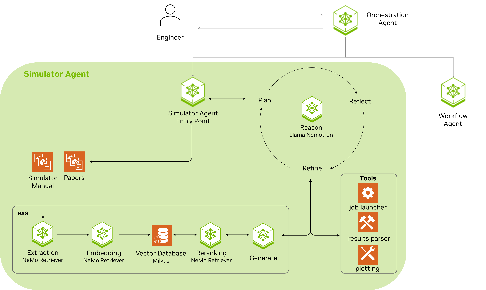

# Simulator Agent

Conversational AI assistant for simulation workflows: manual lookups, running cases, plotting, and analyzing the results.

## Architecture



| Component | Purpose |
|-----------|---------|
| **Query Decomposition** | Plans multi-step tool sequences from user queries using [TOOL_DECISION_TREE](src/simulator_agent/TOOL_DECISION_TREE.md) logic |
| **ReAct Agent** | Reasoning + acting loop; executes the plan and decides which tools to call |
| **Skills** | Skills used by the agent to parse input files, run simulations, retrieve docs, read and analyze results, and plot. See [skills/](src/simulator_agent/skills/) for details. |


## Quick Start

### Prerequisites

- Docker
- [NVIDIA API key](https://build.nvidia.com)

### Run via main repo (recommended)

From the repo root, use the unified setup:

```bash
./scripts/setup.sh --full
docker compose -f docker-compose-full.yml run --rm agent
```

### Run standalone

```bash
cd sim_agent
export NVIDIA_API_KEY="your_key_here"
./scripts/clean_start.sh
docker exec -it sim-agent bash
python -m simulator_agent --interactive
```

### Docker Compose

- `docker compose up -d` — sim-agent + Milvus
- `docker compose --profile ocr up -d` — + ocr-vllm (GPU, for manual PDF ingestion)

## Data Preprocessing (optional)

To ingest PDF manuals: add PDFs to `data/knowledge_base/papers/`, then run:

```bash
./scripts/knowledge_base/ingest_papers.sh
```

This processes all PDFs in that directory (PDF→PNG→OCR→Milvus). Requires OCR service (`docker compose --profile ocr up -d`). See `data/knowledge_base/papers/README.md`.

## Key Dependencies

- [OPM Flow](https://opm-project.org/) — Reference simulator (workflow and manual align with industry-standard simulators)
- [pyflowdiagnostics](https://github.com/GEG-ETHZ/pyflowdiagnostics) — Flow diagnostics (time-of-flight, allocation, Lorenz coefficient)

Both are automatically installed via the setup script.


