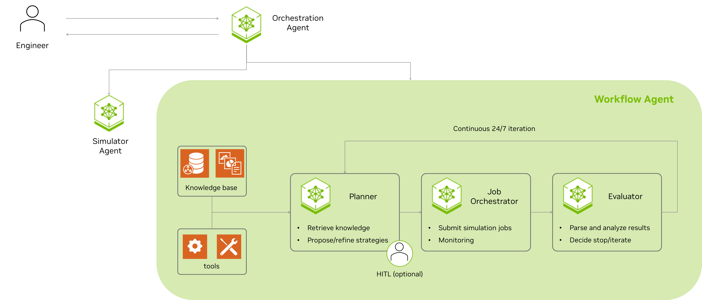

# Workflow Agent

Multi-agent squad for simulation-intensive workflows (optimization, history matching, uncertainty quantification, etc.). These workflows drive subsurface decisions but suffer from **dead time**—results finish during off-hours and sit idle—and a **heuristic pause**—an expert must synthesize high-dimensional data after each cycle to decide the next parameters. The squad acts as a 24/7 orchestration layer: when a cycle finishes, data is synthesized, parameters are proposed, and the next run is launched. Engineers retain supervisory control (HITL).

## Architecture



| Component | Purpose |
|-----------|---------|
| **LangGraph** | Multi-agent state machine; orchestrates analyst, proposer, critic, result analyst |
| **Agents** | Reservoir analyst, strategy proposer, critic, result analyst, knowledge retriever |
| **Workflow** | Simulation workflow (GA/PSO) in `workflow/` - replaceable subprocess |

## Quick Start

### Prerequisites

- Docker
- [NVIDIA API key](https://build.nvidia.com)

### Run via main repo (recommended)

From the repo root:

```bash
./scripts/setup.sh --full
docker compose -f docker-compose-full.yml run --rm agent
```

Then route a query such as: `Run optimization with workflow_agent/conf/config.yaml`.

### Run standalone

```bash
cd workflow_agent
docker compose build
docker compose up -d
docker exec -it agent bash
python -m workflow_agent \
  --workflow-config conf/config.yaml \
  workflow/optimization/conf/testcase_ga.yaml \
  --iterations 1
```

Use `--log-level DEBUG` for verbose logging.

## Replacing the workflow module

`workflow/` is a reference implementation. To use your own:

1. Replace `workflow/` with your code or a thin wrapper that invokes your executable.
2. Set `workflow.run_command` and `workflow.run_cwd` in the workflow config.
3. Write `*_results.json` and `*_evaluations.csv` under each experiment output dir. See `workflow_executor.py` for the format.

## Key Dependencies

- [pymoo](https://pymoo.org/) — Multi-objective optimization (GA, PSO)
- [OPM Flow](https://opm-project.org/) — Reference simulator used by the bundled workflow

