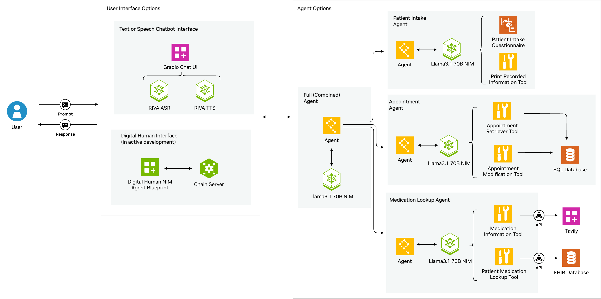

# Agentic Healthcare Front Desk



An agentic healthcare front desk can assist patients and the healthcare professionals in various scanarios: it can assist with the new patient intake process, going over each of the fields in a enw patient form with the patients; it can assist with the appointment scheduling process, looking up available appointments and booking them for patients after conversing with the patient to find out their needs; it can help look up the patient's medications and general information on the medications, and more.

The front desk assistant contains agentic LLM NIM with tools calling capabilities implemented in the LangGraph framework.

Follow along this repository to see how you can create your own digital human for Healthcare front desk that combines NVIDIA NIM, ACE Microservices, RIVA ASR and TTS.

We will offer two options for interacting with the agentic healthcare front desk: with a text / voice based Gradio UI or with a digital human avatar you can converse with.


> [!NOTE]  
> Currently, there is an higher latency expected during LLM tool calling. Interaction with the agent could take a few seconds for non tool calling responses, and could take much higher (30+ seconds) for tool calling responses. If you're utilizing the NVIDIA AI Endpoints for the LLM, which is the default for this repo, latency can vary depending on the traffic to the endpoints. An improvement to this tool call latency issue is in development for the LLM NIMs, please stay tuned.

> [!IMPORTANT]
> Integration with ACE is under active development and will be available soon.

[NVIDIA ACE](https://developer.nvidia.com/ace) is a suite of real-time AI solutions for end-to-end development of interactive avatars and digital human applications at-scale. Its customizable microservices offer the fastest and most versatile solution for bringing avatars to life at-scale. The image below from the GitHub repository for `NIM Agent Blueprint: Digital Human for Customer Service` show the components in the ACE stack on the left side of the dotted line. The components shown on the right side of the dotted line starting from `Fast API` will be replaced by our own components in the agentic healthcare front desk.


## Table of Contents
1. [Introduction](#introduction)
2. [Prerequisites](#prerequisites)
3. [Run Instructions](#run-instructions)
4. [Customization](#customization)


## Introduction
In this repository, we demonstrate the following:
* A customer care agent in Langgraph that has three specialist assistants: patient intake, medication assistance, and appointment making, with corresponding tools.
* A customer care agent in Langgraph for patient intake only. 
* A customer care agent in Langgraph for appointment making only.
* A customer care agent in Langgraph for medication lookup only.
* A Gradio based UI that allows us to use voice or typing to converse with any of the four agents.
* A chain server.

The agentic tool calling capability in each of the customer care assistants is powered by LLM NIMs - NVIDIA Inference Microservices. With the agentic capability, you can write your own tools to be utilized by LLMs.

## Prerequisites
### Hardware 
There are no local GPU requirements for running any application in this repo. The LLMs utilized in LangGraph in this repo are by default set to calling NVIDIA AI Endpoints, as seen in the directory [`graph_definitions/`](./graph_definitions/), and require a valid NVIDIA API KEY.
```python
from langchain_nvidia_ai_endpoints import ChatNVIDIA
llm_model = "meta/llama-3.1-70b-instruct" 
assistant_llm = ChatNVIDIA(model=llm_model)
```
You can experiment with other LLMs available on build.nvidia.com by changing the `model` param for `ChatNVIDIA` in the Python files in the directory [`graph_definitions/`](./graph_definitions/).

If instead of calling NVIDIA AI Endpoints with an API key, you would like to host your own LLM NIM instance, please refer to the [Docker tab of the LLM NIM](https://build.nvidia.com/meta/llama-3_1-70b-instruct?snippet_tab=Docker) on how to host, and add a [`base_url` parameter](https://python.langchain.com/docs/integrations/chat/nvidia_ai_endpoints/#working-with-nvidia-nims) to point to your own instance when specifying `ChatNVIDIA` in the Python files in the directory [`graph_definitions/`](./graph_definitions/). For the hardware configuration of self hosting the LLM, please refer to the [documentation for LLM support matrix](https://docs.nvidia.com/nim/large-language-models/latest/support-matrix.html).

### NVIDIA API KEY
You will need an NVIDIA API KEY to call NVIDIA AI Endpoints.  You can use different model API endpoints with the same API key, so even if you change the LLM specification in `ChatNVIDIA(model=llm_model)` you can still use the same API KEY.

a. Navigate to [https://build.nvidia.com/explore/discover](https://build.nvidia.com/explore/discover).

b. Find the **Llama 3.1 70B Instruct** card and click the card.


c. Click **Get API Key**.


Log in if you haven't already.

d. Click **Generate Key**.


e. Click **Copy Key** and then save the API key. The key begins with the letters ``nvapi-``.


### Software

- Linux operating systems (Ubuntu 22.04 or later recommended)
- [Docker](https://docs.docker.com/engine/install/)
- [Docker Compose](https://docs.docker.com/compose/install/)


## Run Instructions

As illustrated in the diagrams in the beginning, in this repo, we could run two types of applications, one is a FastAPI-based chain server, the other one is a simple voice/text Gradio UI for the healthcare agent. In this documentation, we will be showing how to use the Gradio UI, with instructions for connecting the chain server to ACE coming soon.

Regardless of the type of application you'd like to run, first, please add your API Keys.

### 1. Add Your API keys Prior to Running
In the file `vars.env`, add two API keys of your own:
```
NVIDIA_API_KEY="nvapi-" 
TAVILY_API_KEY="tvly-"
```
Note the Tavily key is only required if you want to run the full graph or the medication lookup graph. Get your API Key from the [Tavily website](https://app.tavily.com/). This is used in the tool named `medication_instruction_search_tool` in [`graph.py`](./graph_definitions/graph.py) or [`graph_medication_lookup_only.py`](./graph_definitions/graph_medication_lookup_only.py).

### 2. Running the simple voice/text Gradio UI
To spin up a simple Gradio based web UI that allows us to converse with one of the agents via voice or typing, run one of these following services.

##### 2.1 The patient intake agent 
Run the patient intake only agent.

```sh
# to run the container with the assumption we have done build:
docker compose up -d patient-intake-ui
# or to build at this command:
docker compose up --build -d patient-intake-ui
```

Note this will be running on port 7860 by default. If you need to run on a different port, modify the [`docker-compose.yaml`](./docker-compose.yaml) file's `patient-intake-ui` section and replace all mentions of 7860 with your own port number.

[Launch the web UI](#25-launch-the-web-ui) on your Chrome browser, you should see this interface:


To bring down the patient intake UI:
```sh
docker compose down patient-intake-ui
```


##### 2.2 The appointment making agent 
Run the appointment making only agent.
```sh
# to run the container with the assumption we have done build:
docker compose up -d appointment-making-ui
# or to build at this command:
docker compose up --build -d appointment-making-ui
```

Note this will be running on port 7860 by default. If you need to run on a different port, modify the [`docker-compose.yaml`](./docker-compose.yaml) file's `appointment-making-ui` section and replace all mentions of 7860 with your own port number.

[Launch the web UI](#25-launch-the-web-ui) on your Chrome browser, you should see the same web interface as above.

To bring down the appointment making UI:
```sh
docker compose down appointment-making-ui
```

##### 2.3 The full agent 
Run the full agent comprising of three specialist agents.
```sh
# to run the container with the assumption we have done build:
docker compose up -d full-agent-ui
# or to build at this command:
docker compose up --build -d full-agent-ui
```

Note this will be running on port 7860 by default. If you need to run on a different port, modify the [`docker-compose.yaml`](./docker-compose.yaml) file's `full-agent-ui` section and replace all mentions of 7860 with your own port number.

[Launch the web UI](#25-launch-the-web-ui) on your Chrome browser, you should see the same web interface as above.

To bring down the full agent UI:
```sh
docker compose down full-agent-ui
```

##### 2.4 The medication lookup agent 
Run the medication lookup only agent.

```sh
# to run the container with the assumption we have done build:
docker compose up -d medication-lookup-ui
# or to build at this command:
docker compose up --build -d medication-lookup-ui
```

Note this will be running on port 7860 by default. If you need to run on a different port, modify the [`docker-compose.yaml`](./docker-compose.yaml) file's `medication-lookup-ui` section and replace all mentions of 7860 with your own port number.

[Launch the web UI](#25-launch-the-web-ui) on your Chrome browser, you should see the same web interface as above.

To bring down the medication lookup UI:
```sh
docker compose down medication-lookup-ui
```

##### 2.5 Launch the web UI

Go to your web browser, here we have tested with Google Chrome, and type in `<your machine's ip address>:<port number>`. The port number would be `7860` by default, or your modified port number if you changed the port number in [docker-compose.yaml](./docker-compose.yaml). Please note that, before you can use your mic/speaker to interact with the web UI, you will need to enable the origin ([reference](https://github.com/NVIDIA/GenerativeAIExamples/blob/main/docs/using-sample-web-application.md#troubleshooting)):

If you receive the following `"Media devices could not be accessed"` error message when you first attempt to transcribe a voice query, perform the following steps.

1. Open another browser tab and enter `chrome://flags` in the location field.

1. Enter `insecure origins treated as secure` in the search field.

1. Enter `http://<host-ip>:7860` (or your own port number) in the text box and select **Enabled** from the menu.

1. Click **Relaunch**.

1. After the browser opens, grant `http://host-ip:7860` (or your own port number) access to your microphone.

1. Retry your request on the web UI.

## Customization
To customize for your own agentic LLM in LangGraph with your own tools, the [LangGraph tutorial on customer support](https://langchain-ai.github.io/langgraph/tutorials/customer-support/customer-support/) is helpful, where you'll find detailed explanations and steps of creating tools and agentic LLM in LangGraph. Afterwards, you can create your own file similar to the graph files in [`graph_definitions/`](./graph_definitions/) which can connect to the simple voice/text Gradio UI by calling [`launch_demo_ui`](./graph_definitions/graph_patient_intake_only.py#L184), or can be imported by the [chain server](./chain_server/chain_server.py#L31).

