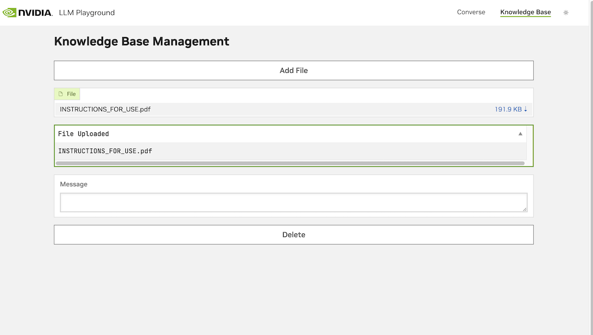
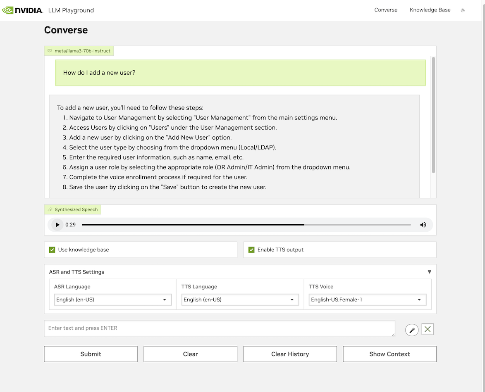
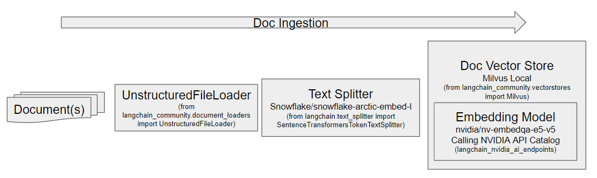
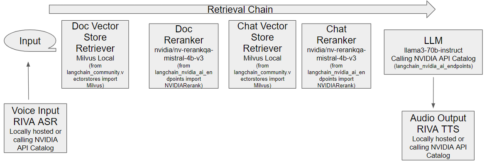

<!--
  SPDX-FileCopyrightText: Copyright (c) 2024 NVIDIA CORPORATION & AFFILIATES. All rights reserved.
  SPDX-License-Identifier: Apache-2.0
-->

# Medical Device Training Assistant

## Background 
Medical devices, such as surgical robots, are complex machines that require extensive training prior to safe use by clinicians and other Operating Room (OR) staff. Timely and accurate answers to medical device questions during and after training can improve the trust and satisfaction of device operators and improve efficiency and effectiveness of training. The medical device's "Instructions For Use" (IFU) is a manual that contains information about the usage of the device, but it is often difficult to find answers to questions efficiently due to its verbosity and technical language.

In this application, we show the capability of using Retrieval Augmented Generation (RAG) powered by NVIDIA NIMs to enhance that training experience by enabling clinicians and other OR staff to ask the IFU directly with their questions at any hour of any day. 

## Overview 
This RAG (Retrieval Augmented Generation) application is based on https://github.com/NVIDIA/GenerativeAIExamples/tree/main/RetrievalAugmentedGeneration/examples/multi_turn_rag.

With this application, you will be able to use a rag-playground UI to interact with a chain server of file loader, text splitter, embedding model, vector database, and LLM. You can first upload your IFU (Instructions-For-Use) in the Knowledge Base:


Then use voice command to ask queries to the RAG regarding information in your IFU and get the answer back through the speakers with no interruption to your routine:


The components involved in ingesting documents into the knowledge base:


The components involved in creating an answer from a query:


## Example Features

This example showcases conversational AI in a RAG pipeline.
The chain server stores the conversation history and knowledge base in a vector database and retrieves them at runtime to understand contextual queries.

The example supports ingestion of PDF and text files.
The documents are ingested in a dedicated document vector store.
The prompt for the example is tuned to act as a document chat bot.
To maintain the conversation history, the chain server stores the previously asked query and the model's generated answer as a text entry in a different and dedicated vector store for conversation history, conv_store.
Both of these vector stores are part of a LangChain [LCEL](https://python.langchain.com/docs/expression_language/) chain as LangChain Retrievers.
When the chain is invoked with a query, the query passes through both the retrievers.
The retriever retrieves context from the document vector store and the closest-matching conversation history from conversation history vector store.
Afterward, the chunks are added into the LLM prompt as part of the chain.

|          Model          |        Embedding        |        Ranking (Optional)        | Framework | Vector Database |  File Types  |
| ----------------------- | ----------------------- | -------------------------------- | --------- | --------------- | ------------ |
| meta/llama3-70b-instruct | nvidia/nv-embedqa-e5-v5 | nvidia/nv-rerankqa-mistral-4b-v3 | LangChain | Milvus          | TXT, PDF, MD |


## Prerequisites
### API Keys
Complete the [common prerequisites](../../../docs/common-prerequisites.md). This will give you two API keys for the next section, one for `NVIDIA_API_KEY` and one for `NGC_API_KEY`.
### RIVA Setup
Assuming you would like to enable RIVA ASR and TTS to use your voice for interacting with the RAG, refer to the [Local RIVA Server](../../../docs/riva-asr-tts.md#local-riva-server) section on running RIVA containers on the local machine's compute resources, or refer to [Riva API Endpoint on NVIDIA API Catalog](../../../docs/riva-asr-tts.md#riva-api-endpoint-on-nvidia-api-catalog) to access RIVA speech models on NVIDIA API Catalog instead of hosting them locally. Refer to the rest of the [documentation on RIVA](../../../docs/riva-asr-tts.md) to configure the docker-compose.yaml file. 

### Hardware Requirement
The Milvus Vector Database is GPU-enabled by default in this IFU RAG application, which is specified in [docker-compose-vectordb.yaml](./docker-compose-vectordb.yaml). Please refer to the section [Configuring Milvus with GPU Acceleration](../../../docs/vector-database.md#configuring-milvus-with-gpu-acceleration) to see how to set GPU acceleration on and off.

## Build and Start the Containers

1. Export the API keys from the [common prerequisites](../../../docs/common-prerequisites.md) above as environment variables:

   ```text
   export NVIDIA_API_KEY="nvapi-<...>"
   export NGC_API_KEY="<...>"
   ```
   Depending on whether you're running RIVA TTS and ASR locally or using Riva API Endpoint on NVIDIA API Catalog, modify the [docker-compose.yaml](./docker-compose.yaml) file in `rag-playground`'s `environment:` section. Only one set of env vars should be uncommented. By default, it is set to use the Riva API Endpoint on NVIDIA API Catalog.

   ```yaml
   # if locally hosting Riva:
   RIVA_API_URI: <riva-ip-address>:50051
   TTS_SAMPLE_RATE: 48000
   ```
   or
   ```yaml
   # if using Riva API Endpoint on NVIDIA API Catalog
   RIVA_API_URI: grpc.nvcf.nvidia.com:443
   NVIDIA_API_KEY: ${NVIDIA_API_KEY}
   RIVA_ASR_FUNCTION_ID: 1598d209-5e27-4d3c-8079-4751568b1081
   RIVA_TTS_FUNCTION_ID: 0149dedb-2be8-4195-b9a0-e57e0e14f972
   TTS_SAMPLE_RATE: 48000
   ```
   Note that the `RIVA_ASR_FUNCTION_ID` and `RIVA_TTS_FUNCTION_ID` values are from `--metadata function-id` field shown in https://build.nvidia.com/nvidia/parakeet-ctc-1_1b-asr/api and https://build.nvidia.com/nvidia/fastpitch-hifigan-tts/api. If there are other models available on https://build.nvidia.com/explore/speech of interest, you can try them as well by changing these two environment variables.
1. Start the containers:

   ```console
   cd industries/healthcare/medical-device-training-assistant
   docker compose up -d --build
   ```

   *Example Output*

   ```output
   ✔ Network nvidia-rag                               Created
   ✔ Container milvus-etcd                            Running
   ✔ Container milvus-minio                           Running
   ✔ Container milvus-standalone                      Running
   ✔ Container chain-server                           Started
   ✔ Container rag-playground                         Started

   ```

1. Confirm the containers are running:

   ```console
   docker ps --format "table {{.ID}}\t{{.Names}}\t{{.Status}}"
   ```

   *Example Output*

   ```output
   CONTAINER ID   NAMES               STATUS
   dd4fc3da6c9c   rag-playground      Up About a minute
   ac1f039a1db8   chain-server        Up About a minute
   cd0a57ee20e0   milvus-standalone   Up 2 hours
   a36370e7ed75   milvus-minio        Up 2 hours (healthy)
   a796a4e59b68   milvus-etcd         Up 2 hours (healthy)

   ```

1. Open a web browser and access <http://localhost:8090> to use the RAG Playground.

   Refer to [Using the Sample Web Application](../../../docs/using-sample-web-application.md)
   for information about uploading documents and using the web interface.

## Troubleshooting
If you see any errors while navigating the web UI, you could use `docker logs chain-server` or `docker logs rag-playground` etc to look into the logs, as the errors shown on the web UI can't described the entire trace.

## Next Steps

- [Vector Database Customizations](../../../docs/vector-database.md) to disable GPU acceleration for the Milvus vector database.
- Stop the containers by running `docker compose down`.
- If you're interested in adapting this application to use on premises machines for NVIDIA Inference Microservices (NIMs), for the LLM, embedding model and reranking model, please refer to [local-deploy README](../../../RAG/examples/local_deploy/README.md) for the requirement and configuration.

## Evaluating the IFU RAG
In [evaluation/](./evaluation/), you will find the process of evaluating the IFU RAG with pairs of questions and answers as ground truth.

