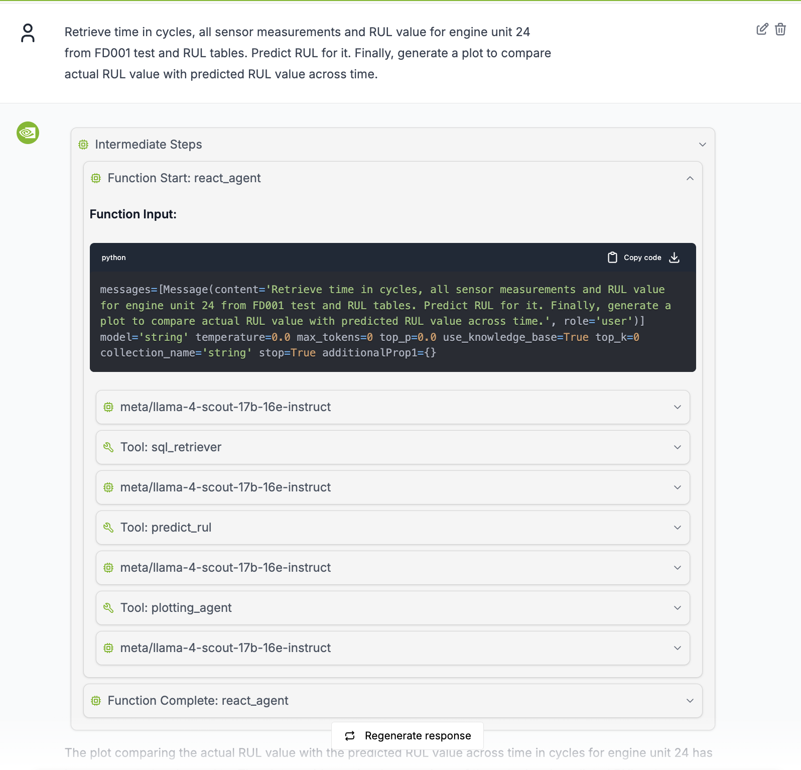

# Predictive Maintenance Agent

A comprehensive AI-powered predictive maintenance system built with NVIDIA AIQ Toolkit for turbofan engine health monitoring and failure prediction.

Work done by: Vineeth Kalluru, Janaki Vamaraju, Sugandha Sharma, Ze Yang and Viraj Modak

## Overview

Predictive maintenance prevents costly downtime by identifying potential failures before they occur. This agent leverages AI to analyze sensor data from turbofan engines, predict remaining useful life (RUL), and provide actionable insights for maintenance teams.

### Key Benefits
- **Prevent Costly Downtime**: Identify failures before they occur
- **Optimize Maintenance**: Perform maintenance only when needed
- **Extend Equipment Life**: Monitor health to maximize efficiency
- **Improve Safety**: Prevent catastrophic failures
- **Reduce Costs**: Minimize emergency repairs and disruptions

## Dataset

Uses the **NASA Turbofan Engine Degradation Simulation Dataset (C-MAPSS)** with:
- **21 Sensor Measurements**: Temperature, pressure, vibration, and flow
- **3 Operational Settings**: Different flight conditions
- **Multiple Engine Units**: Each with unique degradation patterns
- **Run-to-Failure Data**: Complete lifecycle from healthy operation to failure

## Architecture

Multi-agent architecture with:
- **React Agent Workflow**: Main orchestration using ReAct pattern
- **SQL Retriever Tool**: Generates SQL queries using NIM LLM
- **RUL Prediction Tool**: XGBoost model for remaining useful life prediction
- **Plotting Agent**: Multi-tool agent for data visualization
- **Vector Database**: ChromaDB for schema information storage



## Setup and Installation

### Prerequisites
- Python 3.11+ (< 3.13)
- Conda or Miniconda
- NVIDIA NIM API access
- Node.js v18+ (for web interface)

### 1. Create Conda Environment

```bash
conda create -n pdm python=3.11
conda activate pdm
```

### 2. Install NVIDIA AIQ Toolkit

```bash
git clone https://github.com/NVIDIA/AIQToolkit.git
cd AIQToolkit
uv pip install -e .
aiq --help

# Optional: Remove cloned repo after installation
# cd .. && rm -rf AIQToolkit
```

### 3. Install Predictive Maintenance Agent

```bash
cd ..
git clone https://github.com/NVIDIA/GenerativeAIExamples.git
cd GenerativeAIExamples/industries/manufacturing/predictive_maintenance_agent
uv pip install -e .
```

### 4. Environment Setup

```bash
export NVIDIA_API_KEY=your_nvidia_api_key_here
```

### 5. Database Setup

1. Download [NASA Turbofan Dataset](https://ti.arc.nasa.gov/tech/dash/groups/pcoe/prognostic-data-repository/)
2. Extract files to `data/` directory
3. Run setup script:
```bash
python setup_database.py
```

### 6. Configure Paths

Update `configs/config.yml` with your local paths for database, models, and output directories.

## Launch Server and UI

### Start AIQ Server
```bash
aiq serve --config_file=configs/config.yml
```
Server runs on `http://localhost:8000`

Note: When using the provided config file, you need to set the PWD_PATH environment variable before starting the AIQ server. This ensures the server can locate all required paths correctly.

Here's how to do it:

```bash
export PWD_PATH=$(pwd)
aiq serve --config_file=configs/config.yml "$@"
```

### Setup Web Interface

```bash
git clone https://github.com/NVIDIA/AIQToolkit-UI.git
cd AIQToolkit-UI
npm ci
npm run dev
```
UI available at `http://localhost:3000`

**Configure UI Settings:**
- Click Settings icon (bottom left)
- Set HTTP URL to `/chat/stream` (recommended)
- Configure theme and WebSocket URL as needed

## Example Prompts

Test the system with these prompts:

**Data Retrieval:**
```
Retrieve RUL of each unit from the FD001 dataset. Then plot the distribution of RUL.
```


**Visualization:**
```
Retrieve the time in cycles and operational setting 1 from the FD001 test table for unit number 1 and plot its value vs time.
```


**Prediction**
```
Retrieve time in cycles, all sensor measurements and RUL value for engine unit 24 from FD001 test and RUL tables. Predict RUL for it. Finally, generate a plot to compare actual RUL value with predicted RUL value across time.
```


## Observability (Optional)

Monitor your system with Phoenix:

```bash
# Docker (recommended)
docker run -p 6006:6006 -p 4317:4317 arizephoenix/phoenix:latest

# Or install as package
uv pip install arize-phoenix
phoenix serve
```

Access dashboard at `http://localhost:6006` to monitor traces, performance, and costs.

## Next Steps

The agent provides a foundation for industrial AI applications. Planned enhancements include: memory layer for context retention, parallel tool execution for faster responses, action recommendation reasoning agent, real-time fault detection, and integration with NVIDIA's NV-Tesseract foundation models for improved accuracy.

---

**Resources:**
- [NVIDIA AIQ Toolkit Documentation](https://docs.nvidia.com/aiq-toolkit/)
- [Phoenix Observability](https://phoenix.arize.com/)
- [NV-Tesseract Models](https://developer.nvidia.com/blog/new-nvidia-nv-tesseract-time-series-models-advance-dataset-processing-and-anomaly-detection/)