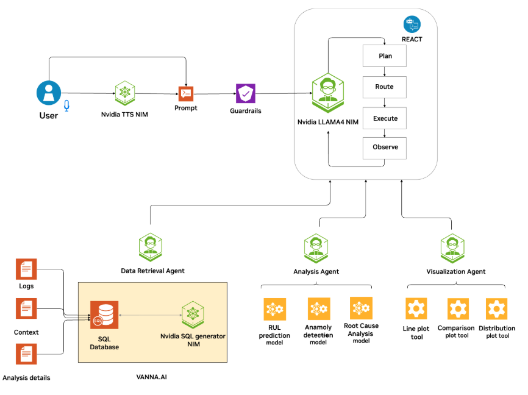

# Predictive Maintenance Agent

A comprehensive AI-powered predictive maintenance system built with NVIDIA AIQ Toolkit for turbofan engine health monitoring and failure prediction.

Work done by: Vineeth Kalluru, Janaki Vamaraju, Sugandha Sharma, Ze Yang and Viraj Modak

## Overview

Predictive maintenance prevents costly downtime by identifying potential failures before they occur. This agent leverages AI to analyze sensor data from turbofan engines, predict remaining useful life (RUL), and provide actionable insights for maintenance teams.

### Key Benefits
- **Prevent Costly Downtime**: Identify failures before they occur
- **Optimize Maintenance**: Perform maintenance only when needed
- **Extend Equipment Life**: Monitor health to maximize efficiency
- **Improve Safety**: Prevent catastrophic failures
- **Reduce Costs**: Minimize emergency repairs and disruptions

## Dataset

Uses the **NASA Turbofan Engine Degradation Simulation Dataset (C-MAPSS)** with:
- **21 Sensor Measurements**: Temperature, pressure, vibration, and flow
- **3 Operational Settings**: Different flight conditions
- **Multiple Engine Units**: Each with unique degradation patterns
- **Run-to-Failure Data**: Complete lifecycle from healthy operation to failure

## Architecture

Multi-agent architecture with:
- **React Agent Workflow**: Main orchestration using ReAct pattern
- **SQL Retriever Tool**: Generates SQL queries using NIM LLM
- **RUL Prediction Tool**: XGBoost model for remaining useful life prediction
- **Plotting Agent**: Multi-tool agent for data visualization
- **Vector Database**: ChromaDB for schema information storage

#### Agentic workflow architecture diagram


#### Agentic workflow architecture diagram w/ reasoning


## Setup and Installation

### Prerequisites
- Python 3.11+ (< 3.13)
- Conda or Miniconda
- NVIDIA NIM API access
- Node.js v18+ (for web interface)

### 1. Create Conda Environment

```bash
conda create -n pdm python=3.11
conda activate pdm
```

### 2. Install NVIDIA Nemo Agent Toolkit

1. Clone the NeMo Agent toolkit repository to your local machine.
   ```bash
   git clone git@github.com:NVIDIA/NeMo-Agent-Toolkit.git aiqtoolkit
   cd aiqtoolkit
   ```

2. Initialize, fetch, and update submodules in the Git repository.
   ```bash
   git submodule update --init --recursive
   ```

3. Fetch the data sets by downloading the LFS files.
   ```bash
   git lfs install
   git lfs fetch
   git lfs pull
   ```
4. Install the NeMo Agent toolkit library.
   To install the NeMo Agent toolkit library along with all of the optional dependencies. Including developer tools (`--all-groups`) and all of the dependencies needed for profiling and plugins (`--all-extras`) in the source repository, run the following:
   ```bash
   uv sync --all-groups --all-extras
   ```


### 3. Install Predictive Maintenance Agent

```bash
cd ..
git clone https://github.com/NVIDIA/GenerativeAIExamples.git
cd GenerativeAIExamples/industries/manufacturing/predictive_maintenance_agent
uv pip install -e .
```

### 4. Environment Setup
Export all the required environment variables form dot.env file. Update the file with your API key and secrets
before running.

```bash
source dot.env
```

### 5. Database Setup

1. Download [NASA Turbofan Dataset](https://ti.arc.nasa.gov/tech/dash/groups/pcoe/prognostic-data-repository/)
2. Extract files to `data/` directory
3. Run setup script:
```bash
python setup_database.py
```

### 6. Configure Paths

Update `configs/config.yml`and '`configs/config-reasoning.yml` with your local paths for database, models, and output directories.

### configs/config.yml or configs/config-reasoning.yml
  The db_path must point to the database inside your data directory.
```bash
db_path: "${PWD_PATH}/data/nasa_turbo.db"  # ← set it to something like this
```
Create an empty folder for the output data and point the output folder to that path 
```bash
output_folder: "${PWD_PATH}/output_data" # ← set it to something like this
```


## Launch Server and UI

### Start AIQ Server

When using the provided config file, you need to set the PWD_PATH environment variable before starting the AIQ server. This ensures the server can locate all required paths correctly.

Here's how to do it: 

```bash
aiq serve --config_file=configs/config.yml "$@"
```
(or)
```bash
aiq serve --config_file=configs/config-reasoning.yml "$@"
```
Server runs on `http://localhost:8000`

### Spin up code execution sandbox for Reasoning workflow

If you plan to use the reasoning config, then it requires you to spin up a code execution sandbox server in a separate terminal.

Note: You will need a system that can run docker. If you are running this on a MacOS laptop with no Docker Desktop then try [Colima](https://github.com/abiosoft/colima)

Go to folder

```bash
cd /path-to/NeMo-Agent-Toolkit/src/aiq/tool/code_execution
```

Run server by mounting your workflow's output folder as an internal volume

```bash
./local_sandbox/start_local_sandbox.sh local-sandbox \\
/path-to-output-folder-as-specified-in-config-yml/
```

(eg)

```bash
./local_sandbox/start_local_sandbox.sh local-sandbox \\
/path-to/GenerativeAIExamples/industries/manufacturing/predictive_maintenance_agent/output_data
```

[Optional] Create a new terminal to test your sandbox by running the python script.

```bash
./test_code_execution_sandbox.py
```

Close the new terminal for testing, you don't need it anymore.

### Setup Web Interface

```bash
git clone https://github.com/NVIDIA/AIQToolkit-UI.git
cd AIQToolkit-UI
npm ci
npm run dev
```
UI available at `http://localhost:3000`

**Configure UI Settings:**
- Click Settings icon (bottom left)
- Set HTTP URL to `/chat/stream` (recommended)
- Configure theme and WebSocket URL as needed
- Check "Enable intermediate results" and "Enable intermediate results by default" if you prefer to see all the agent calls while the workflow runs.

## Example Prompts

Test the system with these prompts:

**Data Retrieval:**
```
Retrieve the time in cycles and operational setting 1 from the FD001 test table for unit number 1 and plot its value vs time.
```


**Visualization:**
```
Retrieve real RUL of each unit in the FD001 test dataset. Then plot a distribution of it.
```


**Prediction**
```
Retrieve time in cycles, all sensor measurements and RUL value for engine unit 24 from FD001 test and RUL tables. Predict RUL for it. Finally, generate a plot to compare actual RUL value with predicted RUL value across time.
```


## Observability (Optional)

### Monitor your system with Phoenix:

```bash
# Docker (recommended)
docker run -p 6006:6006 -p 4317:4317 arizephoenix/phoenix:latest

# Or install as package
uv pip install arize-phoenix
phoenix serve
```
Access dashboard at `http://localhost:6006` to monitor traces, performance, and costs.


## Evaluation

### Evaluate with AIQ 

[TBD]

### Evaluate With Catalyst:

Follow instructions [here](https://github.com/NVIDIA/NeMo-Agent-Toolkit/blob/develop/docs/source/workflows/observe/observe-workflow-with-catalyst.md) to setup RAGA AI profile
and setup secrets.

[TBD]

## Next Steps

The agent provides a foundation for industrial AI applications. Planned enhancements include:
- Memory layer for context retention
- Parallel tool execution for faster responses
- Action recommendation agent
- Real-time fault detection agent
- Integration with NVIDIA's NV-Tesseract foundation models for improved accuracy.
- Integration with Nemo Retriever for data source context.
- Expansion of eval dataset with complex queries that involve creating Advanced SQL queries like CTEs etc.
---

**Resources:**
- [NVIDIA AIQ Toolkit Documentation](https://docs.nvidia.com/aiq-toolkit/)
- [Phoenix Observability](https://phoenix.arize.com/)
- [NV-Tesseract Models](https://developer.nvidia.com/blog/new-nvidia-nv-tesseract-time-series-models-advance-dataset-processing-and-anomaly-detection/)
