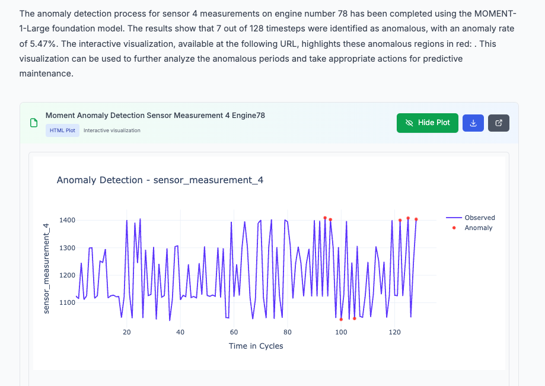

# Predictive Maintenance Agent

A comprehensive AI-powered predictive maintenance system built with NeMo Agent Toolkit for turbofan engine health monitoring and failure prediction.

Work done by: Vineeth Kalluru, Janaki Vamaraju, Sugandha Sharma, Ze Yang, and Viraj Modak

## Overview

Predictive maintenance prevents costly downtime by identifying potential failures before they occur. This agent leverages AI to analyze sensor data from turbofan engines, predict remaining useful life (RUL), and provide actionable insights for maintenance teams.

### Key Benefits
- **Prevent Costly Downtime**: Identify failures before they occur
- **Optimize Maintenance**: Perform maintenance only when needed
- **Extend Equipment Life**: Monitor health to maximize efficiency
- **Improve Safety**: Prevent catastrophic failures
- **Reduce Costs**: Minimize emergency repairs and disruptions

## Dataset

Uses the **NASA Turbofan Engine Degradation Simulation Dataset (C-MAPSS)** with:
- **21 Sensor Measurements**: Temperature, pressure, vibration, and flow
- **3 Operational Settings**: Different flight conditions
- **Multiple Engine Units**: Each with unique degradation patterns
- **Run-to-Failure Data**: Complete lifecycle from healthy operation to failure

## Architecture

Multi-agent architecture with:
- **ReAct Agent Workflow**: Main orchestration using ReAct pattern
- **SQL Retriever Tool**: Generates SQL queries using NIM LLM
- **RUL Prediction Tool**: XGBoost model for remaining useful life prediction
- **Anomaly Detection Tool**: Detects anomalies in sensor data using time series foundational model
- **Plotting Agents**: Multi-tool agent for data visualization
- **Vector Database**: ChromaDB for storing table schema, Vanna training queries, and documentation

#### Agentic workflow architecture diagram w/ reasoning


## Setup and Installation

### Prerequisites
- Python 3.11+ (< 3.13)
- Conda or Miniconda
- NVIDIA NIM API access
- Node.js v18+ (for web interface)

### 1. Create Conda Environment

```bash
conda create -n pdm python=3.11
conda activate pdm
```

### 2. Install NVIDIA NeMo Agent Toolkit

1. Clone the NeMo Agent Toolkit repository to your local machine:
   ```bash
   git clone git@github.com:NVIDIA/NeMo-Agent-Toolkit.git nat-toolkit
   cd nat-toolkit
   ```

2. Initialize, fetch, and update submodules in the Git repository:
   ```bash
   git submodule update --init --recursive
   ```

3. Fetch the datasets by downloading the LFS files:
   ```bash
   git lfs install
   git lfs fetch
   git lfs pull
   ```
4. Install the NeMo Agent Toolkit library:
   To install the NeMo Agent Toolkit library along with all optional dependencies, including developer tools (`--all-groups`) and all dependencies needed for profiling and plugins (`--all-extras`) in the source repository, run the following:
   ```bash
   uv sync --all-groups --all-extras
   ```

5. Install telemetry plugins:
   ```bash
   uv pip install -e '.[telemetry]'
   ```

### 3. Install Predictive Maintenance Agent

First, clone the GenerativeAIExamples repository inside the parent folder of NeMo-Agent-Toolkit and navigate to the Predictive Maintenance Agent folder:

```bash
git clone https://github.com/NVIDIA/GenerativeAIExamples.git
cd GenerativeAIExamples/industries/manufacturing/predictive_maintenance_agent
```

Clone the MOMENT library from GitHub inside this predictive maintenance agent folder. 
This library is required to perform inference with MOMENT-1 time series foundational models for anomaly detection tasks. More about it [here](https://huggingface.co/AutonLab/MOMENT-1-small).

```bash
git clone https://github.com/moment-timeseries-foundation-model/moment.git
```

Change the pyproject.toml file inside the cloned library: 

```bash
cd moment
vi pyproject.toml
```

Change the NumPy and Transformers dependencies:

```bash
...
dependencies = [
  "huggingface-hub==0.24.0",
  "numpy==1.25.2", # -->  to "numpy==1.26.2"
  "torch~=2.0",
  "transformers==4.33.3", # --> to "transformers>=4.33.3,<5.0.0"
]
...
```

Go back to the predictive maintenance agent folder:

```bash
cd ..
```

Change the path to the cloned MOMENT library in `/path/to/predictive_maintenance_agent/pyproject.toml` if necessary.

Change it from:
```bash
[tool.uv.sources]
momentfm = { path = "/Users/vikalluru/Documents/GenerativeAIExamples/industries/manufacturing/predictive_maintenance_agent/moment", editable = true }
```
to:
```bash
[tool.uv.sources]
momentfm = { path = "/your/path/to/predictive_maintenance_agent/moment", editable = true }
```

This ensures that the MOMENT library will be installed from our cloned version instead of the PyPI release. 
Now install the PDM workflow:

```bash
uv pip install -e .
```

### [Optional] Verify if all prerequisite packages are installed
```bash
uv pip list | grep -E "nvidia-nat|nvidia-nat-ragaai|nvidia-nat-phoenix|vanna|chromadb|xgboost|pytest|torch|matplotlib"
```

### 4. Database Setup

1. Download the [NASA Turbofan Dataset](https://ti.arc.nasa.gov/tech/dash/groups/pcoe/prognostic-data-repository/)
2. Extract files to the `data/` directory
3. Run the setup script:
```bash
python setup_database.py
```

### 5. Configure Paths

**Important**: You need to replace the absolute path `/Users/vikalluru/Documents/GenerativeAIExamples/industries/manufacturing/predictive_maintenance_agent/` with your preferred workspace path in the following files:

1. **`configs/config-reasoning.yml`** - Update the `db_path` and `output_folder` paths
2. **`pyproject.toml`** - Update the MOMENT library path (if you changed it in step 3)

For example, if your workspace is at `/home/user/my_workspace/`, you would replace:
- `/Users/vikalluru/Documents/GenerativeAIExamples/industries/manufacturing/predictive_maintenance_agent/` 
- with `/home/user/my_workspace/`

**Note**: All other paths in the config file can be provided as relative paths from your workspace directory. Only the MOMENT library path in `pyproject.toml` needs to be an absolute path.

The `db_path` should point to the database inside your data directory:
```yaml
db_path: "data/nasa_turbo.db"
```

Create an empty folder for the output data and point the output folder to that path:
```yaml
output_folder: "output_data"
```

### 6. Train Vanna SQL Agent (Important)

Before starting the workflow server, you need to train the Vanna SQL agent with domain-specific knowledge. The `vanna_training_data.yaml` file contains:

- **Synthetic DDL statements**: Table schemas for all NASA turbofan datasets
- **Domain documentation**: Detailed explanations of database structure and query patterns
- **Example queries**: Common SQL patterns for turbofan data analysis
- **Question-SQL pairs**: Natural language to SQL mappings

This training data helps the SQL agent understand:
- How to distinguish between training, test, and RUL tables
- Proper handling of remaining useful life calculations
- Domain-specific terminology and query patterns
- Table relationships and data structure

The training happens automatically when you start the workflow server, using the path specified in `configs/config-reasoning.yml`:
```yaml
vanna_training_data_path: "vanna_training_data.yaml"
```

**Note**: If you modify your database structure or add new query patterns, update the `vanna_training_data.yaml` file accordingly to maintain optimal SQL generation performance.

### 7. Set Environment Variables

Set the required environment variables for the workflow:

1. Update the `.env` file with your actual values:
   ```bash
   # Replace the placeholder values with your actual keys
   NVIDIA_API_KEY="your-actual-nvidia-api-key"
   CATALYST_ACCESS_KEY="your-actual-catalyst-access-key"  # Optional
   CATALYST_SECRET_KEY="your-actual-catalyst-secret-key"  # Optional
   ```

2. Source the file to export the variables:
   ```bash
   source .env
   ```

**Note**: The `.env` file contains placeholder values. Replace them with your actual API keys before sourcing the file.

Verify that the NVIDIA API key is set:

```bash
echo $NVIDIA_API_KEY
```

## Launch Server and UI

### Start FastAPI Server

With other frameworks like LangGraph or CrewAI, users are expected to develop a FastAPI server to interact with their agentic workflow. Fortunately, NeMo Agent Toolkit offers this out of the box with the simple `nat serve --config_file <path-to-file>` command.

Start the server now:

```bash
nat serve --config_file=configs/config-reasoning.yml
```

You should see something like this, which indicates that the server started successfully:

```bash
...
...
INFO:     Application startup complete.
INFO:     Uvicorn running on http://localhost:8000 (Press CTRL+C to quit)
```

During startup, you'll also see Vanna training logs as the SQL agent learns from the `vanna_training_data.yaml` file.

### Start Code Execution Sandbox

The code generation assistant requires a standalone Python sandbox that can execute the generated code. This step starts that sandbox.

Note: You will need a system that can run Docker. If you are running this on a macOS laptop without Docker Desktop, try [Colima](https://github.com/abiosoft/colima).

Navigate to the NeMo Agent Toolkit code execution directory:

```bash
cd /path-to/NeMo-Agent-Toolkit/src/nat/tool/code_execution/
```

Start the sandbox by running the script with your output folder path:

```bash
./local_sandbox/start_local_sandbox.sh local-sandbox /path-to-output-folder-as-specified-in-config-yml/
```

For example:

```bash
./local_sandbox/start_local_sandbox.sh local-sandbox /path-to/GenerativeAIExamples/industries/manufacturing/predictive_maintenance_agent/output_data/
```

[Optional] Verify the sandbox is running correctly:

```bash
# Check health status
curl http://localhost:6000/health

# Test code execution
curl -X POST http://localhost:6000/execute \
  -H 'Content-Type: application/json' \
  -d '{"generated_code": "print(\"Hello from sandbox!\")", "timeout": 10, "language": "python"}'
```

To stop the sandbox when you're done, stop the Docker container:

```bash
docker stop local-sandbox
```

## Workspace Utilities

The predictive maintenance agent includes a powerful **workspace utilities system** that provides pre-built, reliable functions for common data processing tasks. This eliminates the need for the code generation assistant to implement complex algorithms from scratch, resulting in more reliable and consistent results.

### How Workspace Utilities Work

**Location**: The utilities are located in `/workspace/utils/` (which maps to your `output_data/utils/` directory).

**Philosophy**: Instead of asking the LLM to generate complex transformation code through multiple agent layers (which can lose context and introduce errors), the system provides pre-tested utility functions that can be invoked with simple instructions.

**Architecture Benefits**:
- **Reliability**: Pre-tested, robust implementations instead of generated code
- **Consistency**: Same results every time, no variation in algorithm implementation
- **Simplicity**: Reasoning agent just needs to specify "use RUL utility" instead of detailed pseudo-code
- **Error Handling**: Comprehensive validation and user-friendly error messages
- **In-Place Operations**: Files are modified directly, avoiding unnecessary copies

### Available Utilities

#### RUL Transformation Utilities

**`apply_piecewise_rul_transformation(file_path, maxlife=125)`**
- Transforms RUL data to create realistic "knee" patterns
- **Input**: JSON file with engine time series data
- **Output**: Same file modified in-place with transformed RUL values
- **Pattern**: RUL stays constant at `MAXLIFE` until remaining cycles drop below threshold, then decreases linearly to 0
- **Use case**: Creating realistic RUL patterns for comparison with predicted values

**`transform_rul_data(file_path, maxlife=125)`**
- Simplified interface for RUL transformation (same functionality as above)

#### Data Validation Utilities

**`load_and_validate_engine_data(file_path)`**
- Loads and validates engine data from JSON files
- Returns detailed information about data structure, ranges, and sample records
- Useful for data quality checks before processing

**`show_utilities()`**
- Displays help information about all available utilities
- Shows usage examples and function signatures

### Usage in Workflows

**For Users**: When interacting with the system, you can request complex data transformations knowing that reliable utilities will handle the implementation. For example:

```
"Transform the actual RUL data for engine 24 to piecewise representation with MAXLIFE=125"
```

**For Developers**: The code generation assistant automatically uses these utilities when available. The system prompts include instructions to:
1. Check if a task can be accomplished using workspace utilities
2. Import utilities with proper path setup
3. Use utilities instead of custom implementations

### Example Workflow

1. **User Request**: "Compare actual vs predicted RUL for engine unit 24"
2. **System Process**:
   - Retrieves ground truth data from database
   - Predicts RUL using the model
   - **Uses utility**: `utils.apply_piecewise_rul_transformation(data_file, maxlife=125)`
   - Generates comparison visualization
3. **Result**: Clean, reliable transformation with consistent knee pattern

### Adding Custom Utilities

You can extend the utilities by adding new functions to `/output_data/utils/`:

1. **Create your utility function** in `utils/` directory
2. **Import it** in `utils/__init__.py`
3. **Document it** in the help system
4. **Update system prompts** if needed (optional)

**Example utility structure**:
```python
def your_custom_utility(file_path: str, param: int = 100) -> str:
    """
    Your custom utility function.
    
    Args:
        file_path: Path to input file
        param: Your parameter
        
    Returns:
        Success message with details
    """
    # Implementation with error handling
    # ...
    return "✅ Custom utility executed successfully!"
```

### Best Practices

1. **Prefer Utilities**: Always check if existing utilities can handle your task
2. **Error Handling**: Utilities include comprehensive validation - no need to duplicate
3. **In-Place Operations**: Utilities modify files directly, avoiding data duplication
4. **Consistent Interface**: All utilities return descriptive success messages
5. **Documentation**: Use `utils.show_utilities()` to discover available functions

### Setup Web Interface

```bash
git clone https://github.com/NVIDIA/NeMo-Agent-Toolkit-UI.git
cd NeMo-Agent-Toolkit-UI
npm ci
npm run dev
```
The UI is available at `http://localhost:3000`

**Configure UI Settings:**
- Click the Settings icon (bottom left)
- Set HTTP URL to `/chat/stream` (recommended)
- Configure theme and WebSocket URL as needed
- Check "Enable intermediate results" and "Enable intermediate results by default" if you prefer to see all agent calls while the workflow runs

## Example Prompts

Test the system with these prompts:

**Data Retrieval:**
```
Retrieve the time in cycles and operational setting 1 from the FD001 test table for unit number 1 and plot its value vs time.
```


**Visualization:**
```
Retrieve real RUL of each unit in the FD001 test dataset. Then plot a distribution of it.
```


**Prediction and Comparison (Uses Workspace Utilities)**
```
Retrieve time in cycles, all sensor measurements and RUL value for engine unit 24 from FD001 test and RUL tables. Predict RUL for it. Finally, generate a plot to compare actual RUL value with predicted RUL value across time.
```


*Note: This example automatically uses the workspace `apply_piecewise_rul_transformation` utility to create realistic knee-pattern RUL data for comparison, resulting in much cleaner and more meaningful visualizations.*

**Workspace Utilities Demo**
```
Show me what workspace utilities are available, then apply piecewise RUL transformation to engine unit 10 data with MAXLIFE=100.
```

*This example demonstrates how to discover and use workspace utilities directly. The system will show available utilities and then apply the RUL transformation using the pre-built, reliable utility functions.*

**Anomaly Detection**
```bash
Retrieve and detect anomalies in sensor 4 measurements for engine number 78.
```



## Observability (Optional)

### Monitor Your System with Phoenix

Ensure that Phoenix tracing-related information is present in the config file.

Uncomment this portion of `prediction_maintenance_agent/configs/config-reasoning.yml` file:

```yaml
...
    # Uncomment this to enable tracing
    # tracing:
    #   phoenix:
    #     _type: phoenix
    #     endpoint: http://localhost:6006/v1/traces
    #     project: pdm-test # You can replace this with your preferred project name
...
```

```bash
# Docker (recommended)
docker run -p 6006:6006 -p 4317:4317 arizephoenix/phoenix:latest

# Or install as package
uv pip install arize-phoenix
phoenix serve
```
Access the dashboard at `http://localhost:6006` to monitor traces, performance, and costs.

### Monitor Your System with Catalyst

Follow the instructions [here](https://github.com/NVIDIA/NeMo-Agent-Toolkit/blob/develop/docs/source/workflows/observe/observe-workflow-with-catalyst.md) to set up your RAGA AI profile.

Ensure you update the CATALYST-related environment variables in the `.env` file and source that file again:

```bash
CATALYST_ACCESS_KEY="xxxxxxxxxxxxxxxx" # Change this to your RAGA AI Access key
CATALYST_SECRET_KEY="xxxxxxxxxxxxxxxxxxxxxxxx" # Change this to your RAGA AI Secret key
CATALYST_ENDPOINT=https://catalyst.raga.ai/api # Don't change this
```

Uncomment this portion of `prediction_maintenance_agent/configs/config-reasoning.yml` file to enable Catalyst tracing:

```yaml
...
    # Uncomment this to enable tracing
    # tracing:
    #   catalyst:
    #     _type: catalyst
    #     project: "pdm-test" # You can replace this with your preferred project name
    #     dataset: "pdm-dataset" # You can replace this with your preferred dataset name
...
```

You should see Catalyst initialization-related information in the terminal when you launch the workflow server.

## [Optional] Testing the Workflow

NeMo Agent Toolkit provides the flexibility to run workflows not just through terminal commands (`nat serve`) but also programmatically in Python which helps in seamless CI/CD pipeline integration. 

You can test the workflow by running the `test_pdm_workflow.py` file using pytest instead of starting the server, which provides a Pythonic way of building and running the workflow programmatically. This approach is particularly valuable for continuous integration and deployment systems, allowing automated validation of workflow components and streamlined deployment processes.

Ensure that you have set the `$NVIDIA_API_KEY` environment variable before running:

```bash
pytest test_pdm_workflow.py -m e2e -v
```

To run individual tests in the file:

```bash
pytest test_pdm_workflow.py -k "<test_name>" -v
```

## Evaluation

This example comes with 25 curated queries and reference answers that form our evaluation dataset. You can access this in the `eval_data/eval_set_master.json` file.

We have created a smaller version of this dataset in `eval_data/eval_set_test.json` to help with quick checks before running the larger evaluation workflow.

### Evaluate with NAT 

Update the config file with the path to the evaluation set.

In `predictive_maintenance_agent/configs/config-reasoning.yml`:
```yaml
eval:
  general:
    output:
      dir: "eval_output"
      cleanup: true
    dataset:
      _type: json
      file_path: "eval_data/eval_set_master.json" # Path to eval dataset
    query_delay: 10  # Change this to increase delay between running queries, useful if your underlying API (like build.nvidia.com) has requests/second or rate limits
    max_concurrent: 1  # Change this to the number of eval set entries that should be processed concurrently. Keep it at 1 to ensure smooth execution
```

Now, run this command:

```bash
nat eval --config_file configs/config-reasoning.yml
```

You should see an `eval_output` folder generated in your working directory with `multimodal_eval_output.json`. We have provided you with an example output in `eval_output/example_multimodal_eval_output.json`.

## Next Steps

The agent provides a foundation for industrial AI applications. Planned enhancements include:
- Memory layer for context retention
- Parallel tool execution for faster responses
- Action recommendation agent
- Real-time fault detection agent
- Integration with NVIDIA's NV-Tesseract foundation models for improved accuracy
- Integration with NeMo Retriever for data source context
- Expansion of evaluation dataset with complex queries that involve creating advanced SQL queries like CTEs, etc.
---

**Resources:**
- [NeMo Agent Toolkit Documentation](https://docs.nvidia.com/nemo-agent-toolkit/)
- [Phoenix Observability](https://phoenix.arize.com/)
- [NV-Tesseract Models](https://developer.nvidia.com/blog/new-nvidia-nv-tesseract-time-series-models-advance-dataset-processing-and-anomaly-detection/)
