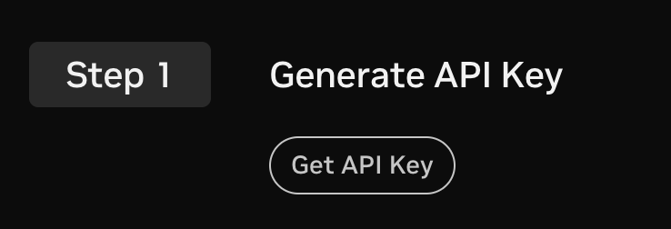

# Detailed Thinking Mode with Llama 3.3 Nemotron Super 49B

In the notebook in this directory, we'll explore how simple it is to leverage thinking mode on, and off, using the Llama 3.3 Nemotron Super 49B NIM - a single model with the ability to modify how it generates responses through a simple toggle in the system prompt.

If you'd like to learn more about this model - please check out our [blog](https://developer.nvidia.com/blog/build-enterprise-ai-agents-with-advanced-open-nvidia-llama-nemotron-reasoning-models/), which goes into exactly how this model was produced.

To begin, we'll first need to download our NIM - which we can do following the detailed instructions on the Llama 3.3 Nemotron Super 49B [model card on build.nvidia.com](https://build.nvidia.com/nvidia/llama-3_3-nemotron-super-49b-v1).

## Downloading Our NIM

First, we'll need to generate our API key, you can find this by navigating to the "Deploy" tab on the build.nvidia.com website.



Next, let's login to the NVIDIA Container Registry using the following command:

```bash
docker login nvcr.io
```

Next, all we need to do is run the following command and wait for our NIM to spin up!

```bash
export NGC_API_KEY=<PASTE_API_KEY_HERE>
export LOCAL_NIM_CACHE=~/.cache/nim
mkdir -p "$LOCAL_NIM_CACHE"
docker run -it --rm \
    --gpus all \
    --shm-size=16GB \
    -e NGC_API_KEY \
    -v "$LOCAL_NIM_CACHE:/opt/nim/.cache" \
    -u $(id -u) \
    -p 8000:8000 \
    nvcr.io/nim/nvidia/llama-3.3-nemotron-super-49b-v1:latest
```

## Using Our NIM!

We'll follow [this notebook](./Detailed%20Thinking%20Mode%20with%20Llama%203.3%20Nemotron%20Super%2049B.ipynb) for some examples on how to use the Llama 3.3 Nemotron Super 49B NIM in both Detailed Think On, and Off mode!