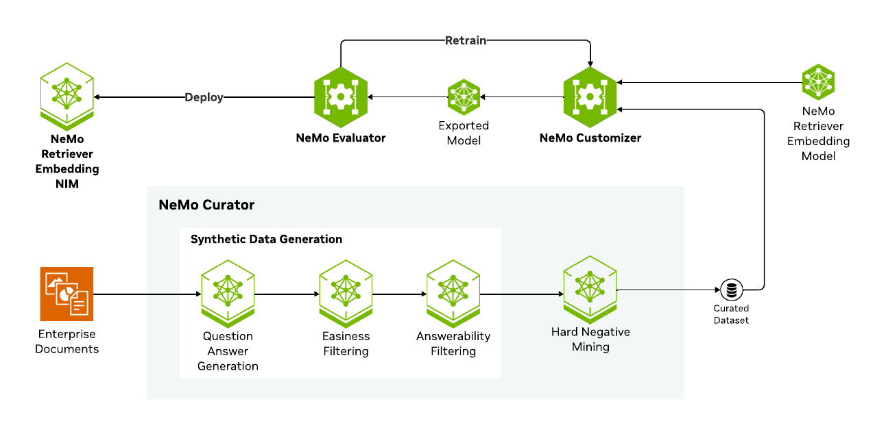

# Embedding Fine-tuning with NVIDIA NeMo Microservices

## Introduction

This guide shows how to fine-tune embedding models using the NVIDIA NeMo Microservices platform to improve performance on domain-specific tasks.

<div style="text-align: center;">
  
  <p><strong>Figure 1:</strong> Workflow for fine-tuning embedding models using NeMo Microservices</p>
</div>

## Objectives

This tutorial shows how to leverage the NeMo Microservices platform for finetuning a [nvidia/llama-3.2-nv-embedqa-1b-v2](https://build.nvidia.com/nvidia/llama-3_2-nv-embedqa-1b-v2/modelcard) embedding model using the [SPECTER](https://huggingface.co/datasets/Salesforce/xlam-function-calling-60k) dataset, then evaluating its accuracy on the (somewhat related) zero-shot [BeIR Scidocs](https://huggingface.co/datasets/BeIR/scidocs) benchmark.

The tutorial covers the following steps:

1. [Download and prepare data for fine-tuning](./1_data_preparation.ipynb)
2. [Fine-tune the embedding model with SFT](./2_finetuning_and_inference.ipynb)
3. [Evaluate the model on a zero-shot Scidocs task](./3_evaluation.ipynb)

**Note:** A typical workflow involves creating query, positive document, and negative document triplets from a text corpus. This may include synthetic data generation (SDG) and hard-negative mining. For a quick demonstration, we use an existing open dataset from Hugging Face.


### About NVIDIA NeMo Microservices

The NVIDIA NeMo microservices platform provides a flexible foundation for building AI workflows such as fine-tuning, evaluation, running inference, or applying guardrails to AI models on your Kubernetes cluster on-premises or in cloud. Refer to [documentation](https://docs.nvidia.com/nemo/microservices/latest/about/index.html) for further information.

### About the SPECTER dataset

The [SPECTER](https://huggingface.co/datasets/embedding-data/SPECTER) dataset contains approximately 684K triplets pertaining to the scientific domain (titles of papers), which can be used to train embedding models. We will use the SPECTER data for finetuning.

## Prerequisites

### Deploy NeMo Microservices

To follow this tutorial, you will need at least two NVIDIA GPUs, which will be allocated as follows:

- **Fine-tuning:** One GPU for fine-tuning the `llama-3.2-nv-embedqa-1b-v2` model using NeMo Customizer.
- **Inference:** One GPU for deploying the `llama-3.2-nv-embedqa-1b-v2` NIM for inference.

Refer to the [platform prerequisites and installation guide](https://docs.nvidia.com/nemo/microservices/latest/get-started/platform-prereq.html) to deploy NeMo Microservices.

> **NOTE:** Fine-tuning for embedding models is supported starting with NeMo Microservices version 25.8.0. Please ensure you deploy NeMo Microservices Helm chart version 25.8.0 or later to use these notebooks.

### Client-Side Requirements

Ensure you have access to:

1. A Python-enabled machine capable of running Jupyter Lab.
2. Network access to the NeMo Microservices IP and ports.

## Get Started

1. Create a virtual environment using uv (recommended for better dependency management):

   ```bash
   # Install uv if not already installed
   curl -LsSf https://astral.sh/uv/install.sh | sh
   
   # Create and activate virtual environment
   uv venv nemo_env
   source nemo_env/bin/activate
   ```

2. Install the required Python packages using requirements.txt with uv:

   ```bash
   uv pip install -r requirements.txt
   ```

3. Update the following variables in [config.py](./config.py) with your specific URLs and API keys.

   ```python
   # (Required) NeMo Microservices URLs
   NDS_URL = "http://data-store.test" # Data Store
   NEMO_URL = "http://nemo.test" # Customizer, Entity Store, Evaluator
   NIM_URL = "http://nim.test" # NIM

   # (Required) Hugging Face Token
   HF_TOKEN = ""

   # (Optional) To observe training with WandB
   WANDB_API_KEY = ""
   ```

4. Launch Jupyter Lab to begin working with the provided tutorials:

   ```bash
   uv run jupyter lab --ip 0.0.0.0 --port=8888 --allow-root
   ```

5. Navigate to the [data preparation notebook](./1_data_preparation.ipynb) to get started.