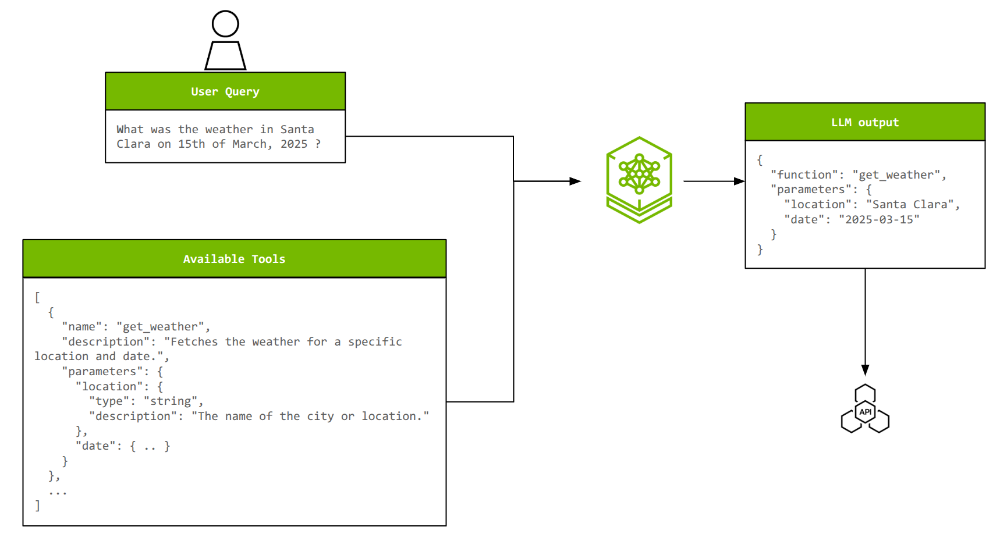
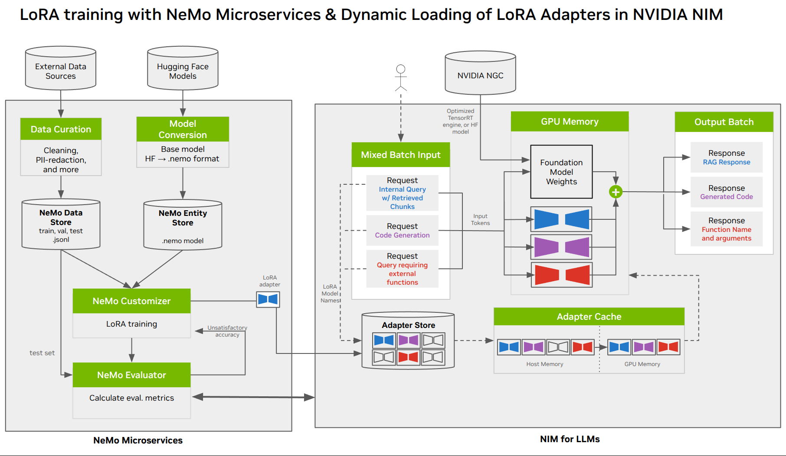

# Fine-tuning, Inference, and Evaluation for LLM tool calling with NVIDIA NeMo Microservices 

## Introduction

Tool calling enables Large Language Models (LLMs) to interact with external systems, execute programs, and access real-time information unavailable in their training data. This capability allows LLMs to process natural language queries, map them to specific functions or APIs, and populate required parameters from user inputs. It's essential for building AI agents capable of tasks like checking inventory, retrieving weather data, managing workflows, and more. It imbues generally improved decision making in agents in the presence of real-time information.

### How LLM Tool Calling Works

- Tools 

A **function** or a **tool** refers to a external functionality provided by the user to the model. As the model generates a reponse to the prompt, it may be decide or can be told to use this functionality provided by a tool to respond to the prompt. In a real world use case, the user can provide a list of tools to get weather for a location, access account details for give nuser id or issue refunds for lost orders etc. Note that these are scenarios where the LLM needs to respond with real-time information outside the pretrained knowledge alone.

- Tool calls 

A **function call** or a **tool call** refers to a model's response when it decides or has been told that it needs to call one of the tools that were made available to it. From the above examples to real-world tools made availabel to a model, if a user sends a prompt like "What's the weather in Paris?", the model will respond to that prompt with a tool call for the **get_weather** tool with **Paris** as the **location** argument. 

- Tool call outputs 

A **function call output** or **tool call output** refers to the response a tool generates using the input from a models's tool call. The tool call outputs can be a structured JSON or plain text. In reference to the real world use cases discussed above, in response to a prompt like "Whats the weather in Paris?", the model returns a tool call that contains the **location** argument with a value of Paris. The tool call output might return a JSON object (e.g., {"temperature": "25", "unit": "C"}, indicating a current temperature of 25 degrees). The model then receives original prompt, tool definition, model's tool call, and the tool call output to generate a text response like:

```bash
The weather in Paris today is 25C.
```

<div style="text-align: center;">

<p><strong>Figure 1:</strong> Example of a single-turn function call. User prompts the model to get the weather in Santa Clara on 15th March 2025. The model has also recieved a function description called get_weather() with location and date as arguments. The model outputs a function call by extracting the location (Santa Clara) and date(15 March) from user's prompt. The application then receives the function call and generates the function call output. Note that in addition to the illustrated blocks, the model also receives the function call output along with the original prompt to generate the final text response. </p>
</div>

### Customizing LLMs for Function Calling

To effectively perform function calling, an LLM must:

- Select the correct function(s)/tool(s) from a set of available options.
- Extract and populate the appropriate parameters for each chosen tool from a user's natural language query.
- In multi-turn (interact with users back-and-forth), and multi-step (break its response into smaller parts) use cases, the LLM may need to plan, and have the capability to chain multiple actions together.

#### Example of tool calling request failing to select the tool 

REQUEST 

```bash
curl "$NEMO_URL/v1/chat/completions" \
  -H "Content-Type: application/json" \
  -d '{
    "model": "gemma-3.2-1b",
    "messages": [
      {
        "role": "user",
        "content": "What will the weather be in Berlin on November 7, 2025?"
      }
    ],
    "tools": [
      {
        "type": "function",
        "function": {
          "name": "get_weather",
          "description": "Get the weather for a given location and date.",
          "parameters": {
            "type": "object",
            "properties": {
              "location": { "type": "string" },
              "date": { "type": "string" }
            },
            "required": ["location", "date"]
          }
        }
      }
    ],
    "tool_choice": "auto"
  }' | jq
```

RESPONSE
 
```bash
"choices": [
    {
      "index": 0,
      "message": {
        "content": "{\"name\": \"get_weather\", \"parameters\": {}}",
        "role": "assistant",
        "reasoning_content": null
      },
      "finish_reason": "stop"
    }
  ],
```

#### Example of LoRA fine-tuned tool calling example 

REQUEST 

```bash
curl "$NEMO_URL/v1/chat/completions" \
  -H "Content-Type: application/json" \
  -d '{
    "model": "gemma-3.2-1b-lora-sft@v1",
    "messages": [
      {
        "role": "user",
        "content": "What will the weather be in Berlin on November 7, 2025?"
      }
    ],
    "tools": [
      {
        "type": "function",
        "function": {
          "name": "get_weather",
          "description": "Get the weather for a given location and date.",
          "parameters": {
            "type": "object",
            "properties": {
              "location": { "type": "string" },
              "date": { "type": "string" }
            },
            "required": ["location", "date"]
          }
        }
      }
    ],
    "tool_choice": "auto"
  }' | jq
```

RESPONSE
 
```bash
choices": [
    {
      "index": 0,
      "message": {
        "role": "assistant",
        "content": null,
        "tool_calls": [
          {
            "type": "function",
            "function": {
              "name": "get_weather",
              "arguments": "{\"location\": \"Berlin\", \"date\": \"2025-11-07\"}"
            }
          }
        ]
      },
      "finish_reason": "tool_calls",
    }
```

As the number of tools and their complexity increases, customization becomes critical for maintaining accuracy and efficiency. Also, smaller models can achieve comparable performance to larger ones through parameter-efficient techniques like [Low-Rank Adaptation (LoRA)](https://arxiv.org/abs/2106.09685). LoRA is compute- and data-efficient, which involves a smaller one-time investment to train the LoRA adapter, allowing you to reap inference-time benefits with a more efficient "bespoke" model.

### About the xLAM dataset

The Salesforce [xLAM](https://huggingface.co/datasets/Salesforce/xlam-function-calling-60k) dataset contains approximately 60,000 training examples specifically designed to enhance language models' function calling capabilities. This dataset has proven particularly valuable for fine-tuning smaller language models (1B-2B parameters) through parameter-efficient techniques like LoRA. The dataset enables models to respond to user queries with executable functions, providing outputs in JSON format that can be directly processed by downstream systems.

### About NVIDIA NeMo Microservices

NVIDIA NeMo is a modular, enterprise-ready software suite for managing the AI agent lifecycle, enabling enterprises to build, deploy, and optimize agentic systems.

NVIDIA NeMo microservices, part of the [NVIDIA NeMo software suite](https://www.nvidia.com/en-us/ai-data-science/products/nemo/), are an API-first modular set of tools that you can use to customize, evaluate, and secure large language models (LLMs) and embedding models while optimizing AI applications across on-premises or cloud-based Kubernetes clusters.

## Objectives

This end-to-end tutorial shows how to leverage the NeMo Microservices platform for customizing [Llama-3.2-1B-Instruct](https://huggingface.co/meta-llama/Llama-3.2-1B-Instruct) using the [xLAM](https://huggingface.co/datasets/Salesforce/xlam-function-calling-60k) function-calling dataset, then evaluating its accuracy, and finally safeguarding the customized model behavior.

<div style="text-align: center;">
  
  <p><strong>Figure 2:</strong> End to End architecture of LoRA training, evaluation, and deployment with NeMo Microservices and NIM</p>
</div>

The following stages will be covered in this set of tutorials:

1. [Preparing Data for fine-tuning and evaluation](./1_data_preparation.ipynb)
2. [Customizing the model with LoRA fine-tuning](./2_finetuning_and_inference.ipynb)
3. [Evaluating the accuracy of the customized model](./3_model_evaluation.ipynb)
4. [Adding Guardrails to safeguard your LLM behavior](./4_adding_safety_guardrails.ipynb)

> **Note:** The LoRA fine-tuning of the Llama-3.2-1B-Instruct model takes up to 45 minutes to complete.

## Prerequisites

### Deploy NeMo Microservices

To follow this tutorial, you will need at least two NVIDIA GPUs, which will be allocated as follows:

- **Fine-tuning:** One GPU for fine-tuning the `llama-3.2-1b-instruct` model using NeMo Customizer.
- **Inference:** One GPU for deploying the `llama-3.2-1b-instruct` NIM for inference.

Refer to the [platform prerequisites and installation guide](https://docs.nvidia.com/nemo/microservices/latest/get-started/platform-prereq.html) to deploy NeMo Microservices.


### Deploy `llama-3.2-1b-instruct` NIM

This step is similar to [NIM deployment instructions](https://docs.nvidia.com/nemo/microservices/latest/get-started/tutorials/deploy-nims.html#deploy-nim-for-llama-3-1-8b-instruct) in documentation, but with the following values:

```bash
# URL to NeMo deployment management service
export NEMO_URL="http://nemo.test"

curl --location "$NEMO_URL/v1/deployment/model-deployments" \
   -H 'accept: application/json' \
   -H 'Content-Type: application/json' \
   -d '{
      "name": "llama-3.2-1b-instruct",
      "namespace": "meta",
      "config": {
         "model": "meta/llama-3.2-1b-instruct",
         "nim_deployment": {
            "image_name": "nvcr.io/nim/meta/llama-3.2-1b-instruct",
            "image_tag": "1.8.3",
            "pvc_size":   "25Gi",
            "gpu":       1,
            "additional_envs": {
               "NIM_GUIDED_DECODING_BACKEND": "fast_outlines"
            }
         }
      }
   }'
```

The NIM deployment described above should take approximately 10 minutes to go live. You can continue with the remaining steps while the deployment is in progress.

### Managing GPU Resources for Model Deployment (If Applicable)

If you previously deployed the `meta/llama-3.1-8b-instruct` NIM during the [Beginner Tutorial](https://docs.nvidia.com/nemo/microservices/latest/get-started/platform-prereq.html), and are running on a cluster with at most two NVIDIA GPUs, you will need to delete the previous `meta/llama-3.1-8b-instruct` deployment to free up resources. This ensures sufficient GPU availability to run the `meta/llama-3.2-1b-instruct` model while keeping one GPU available for fine-tuning.

Note that you can use the content safety NIM via [build.nvidia.com](https://build.nvidia.com/) (using the `integrate.api.nvidia.com` API endpoint). In this case, you do not need to deploy that model within your cluster. Refer to [docs](https://docs.nvidia.com/nemo/microservices/latest/set-up/deploy-as-microservices/guardrails.html) for more information.

```bash
export NEMO_URL="http://nemo.test"

curl -X DELETE "$NEMO_URL/v1/deployment/model-deployments/meta/llama-3.1-8b-instruct"
```

### Client-Side Requirements

Ensure you have access to:

1. A Python-enabled machine capable of running Jupyter Lab.
2. Network access to the NeMo Microservices IP and ports.

### Get access to the xLAM dataset

- Go to [xlam-function-calling-60k](https://huggingface.co/datasets/Salesforce/xlam-function-calling-60k) and request access, which should be granted instantly.
- Obtain your [Hugging Face access token](https://huggingface.co/docs/hub/en/security-tokens).

## Get Started

1. Create a virtual environment. This is recommended to isolate project dependencies.

   ```bash
   python3 -m venv nemo_env
   source nemo_env/bin/activate
   ```

2. Install the required Python packages using requirements.txt.

   ```bash
   pip install -r requirements.txt
   ```

3. Update the following variables in [config.py](./config.py) with your specific URLs and API keys.

   ```python
   # (Required) NeMo Microservices URLs
   NDS_URL = "" # Data Store
   NEMO_URL = "" # Customizer, Entity Store, Evaluator, Guardrails
   NIM_URL = "" # NIM

   # (Required) Hugging Face Token
   HF_TOKEN = ""

   # (Optional) To observe training with WandB
   WANDB_API_KEY = ""
   ```

4. Launch Jupyter Lab to begin working with the provided tutorials.

   ```bash
   jupyter lab --ip 0.0.0.0 --port=8888 --allow-root
   ```

5. Navigate to the [data preparation](./1_data_preparation.ipynb) tutorial to get started.

## Other Notes

### About NVIDIA NIM

- The workflow showcased in this tutorial for tool calling fine-tuning is tailored to work with NVIDIA NIM for inference. It won't work with other inference providers (for example, vLLM, SG Lang, TGI).
- For improved inference speeds, we need to use NIM with `fast_outlines` guided decoding system. This is the default if NIM is deployed with the NeMo Microservices Helm Chart. However, if NIM is deployed separately, then users need to set the `NIM_GUIDED_DECODING_BACKEND=fast_outlines` environment variable.

### Limitations with Tool Calling

If you decide to use your own dataset or implement a different data preparation approach:
- There may be a response delay issue in tool calling due to incomplete type info. Tool calls might take over 30 seconds if descriptions for `array` types lack `items` specifications, or if descriptions for `object` types lack `properties` specifications. As a workaround, make sure to include these details (`items` for `array`, `properties` for `object`) in tool descriptions.
- Response Freezing in Tool Calling (Too Many Parameters): Tool calls will freeze the NIM if a tool description includes a function with more than 8 parameters. As a workaround, ensure functions defined in tool descriptions use 8 or fewer parameters. If this does occur, it requires the NIM to be restarted. This will be resolved in the next NIM release.
