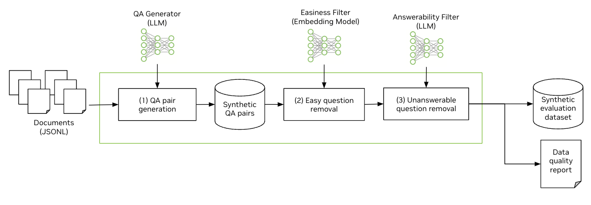

# NeMo Retriever Synthetic Data Generation 

NeMo Retriever Synthetic Data Generation (SDG) is designed to streamline the creation of high-quality evaluation datasets for Text QA retrieval use cases. By leveraging existing enterprise data, this pipeline enables rapid generation of relevant evaluation datasets, facilitating improved model performance. 

This version supports the generation of evaluation datasets, creating synthetic benchmark datasets compatible with commonly used evaluation frameworks such as [BEIR](https://huggingface.co/datasets/BeIR/beir). Synthetic training dataset generation will be supported in an upcoming version.

NeMo Retriever SDG can be run either from the command line, or using the [notebook example](notebooks/quickstart.ipynb) provided in this repository. Check the [Prerequisites](#prerequisites) section for instructions on generating an API key and installing libraries. To get started with the notebook, follow the [Notebook Quick Start](#run-pipeline-ipython-notebook) instructions. Otherwise, follow the [CLI Quick Start](#run-pipeline-cli) section.



#### Key Features

* Quickly generate complex QA datasets from existing text documents for retriever model evaluation.
* Output datasets can be formatted in [SQuAD (Stanford Question Answering Dataset)](https://huggingface.co/datasets/rajpurkar/squad) or [BEIR (Benchmarking Information Retrieval)](https://huggingface.co/datasets/BeIR/beir) format for easy integration into evaluation workflows.
* Designed to integrate seamlessly with [NVIDIA NeMo Evaluator](https://developer.nvidia.com/nemo-microservices) microservice, currently in early access.


## Quickstart

### Prerequisites

In order to use NeMo Retriever SDG, you will need access to NVIDIA’s API Catalog. Go to the [NGC Personal Key Manager](https://org.ngc.nvidia.com/setup) to generate a Personal Key that will allow you to access AI Foundation Models and Endpoints.

To install the required libraries, navigate to the root directory of the project and run the following command in your notebook or command line: 

```
$ pip install -r requirements.txt
```

Alternatively, you can use container `nvcr.io/nvidia/pytorch:24.01-py3`.

```
$ docker pull nvcr.io/nvidia/pytorch:24.01-py3

$ docker run -it --rm --gpus all --ipc host --network host -v $(pwd):/workspace nvcr.io/nvidia/pytorch:24.01-py3

/workspace# pip install -r requirements.txt
/workspace# jupyter notebook
```


### Run Pipeline (iPython notebook)

Navigate to the [quick start notebook](notebooks/quickstart.ipynb) and follow the instructions.

### Run Pipeline (CLI)

The pipeline can be run with datasets in either [SQuAD](https://huggingface.co/datasets/rajpurkar/squad) or rawdoc (only text and title) format. To test the pipeline, you can use the provided example data at ```sample_data_rawdoc.jsonl``` or ```sample_data_squad.json```. 

Navigate to the top level of this project directory and run the following command in your command line. It will take roughly 5-10 minutes. 
> Tip: If you see the following error message:  `ModuleNotFoundError: No module named 'nemo_retriever_sdg'` Try adding `PYTHONPATH=.` to your command.


- `Rawdoc format`

To use rawdoc format, provide your data in a `.jsonl` file. The structure of the data should follow this format: `{"text": <document>, "title": <title>}`.

```
PYTHONPATH=. python scripts/run_pipeline.py \
  api_key=<API Key> \
  input_file=$(pwd)/data/sample_data_rawdoc.jsonl \
  input_format=rawdoc \
  output_dir=$(pwd)/outputs/sample_data_rawdoc
```

- `SQuAD format`

To use SQuAD format, provide your data in a `.json` file. For more information about the expected structure of the data, see the [quick start notebook](notebooks/quickstart.ipynb). 


```
PYTHONPATH=. python scripts/run_pipeline.py \
  api_key=<API Key> \
  input_file=$(pwd)/data/sample_data_squad.json \
  input_format=squad \
  output_dir=$(pwd)/outputs/sample_data_squad
```

### Using Custom Configuration

Edit [config.yaml](scripts/conf/config.yaml) to update the configuration. Predefined configuration files can be found in [scripts/conf](scripts/conf).

To switch to another config file, use `--config-name <config file name>`. For example,

```
PYTHONPATH=. python scripts/run_pipeline.py \
  --config-name config-nq.yaml \
  api_key=<API Key> \
  input_file=$(pwd)/data/nq_test.jsonl \
  input_format=rawdoc \
  output_dir=$(pwd)/outputs/sample_nq
```


## Quality Improvement Playbook (for Advanced Users)


The default config file [config.yaml](scripts/conf/config.yaml) should work best to generate synthetic data for the IT Helpdesk domain. In case you'd like to improve the quality of synthetic data and/or apply the SDG pipeline for other domains, consider applying the recipes described below.


### Prompt templates

We recommend engineering the prompt templates for better synthetic data generations. Specifically, we have observed Chain-of-Thought prompting to result in the better generations as well. We have provided additional config files ([config-nq.yaml](scripts/conf/config-nq.yaml) and [config-fiqa.yaml](scripts/conf/config-fiqa.yaml)) that showcase Chain-of-Thought prompting.

Furthermore, they also showcase the use of in-context learning, wherein passage, query pairs were picked from datasets to be used as few-shot examples. Both methods yields good quality results. 


### Choice of Easiness Filter & Threshold

We provide the embedding-model-as-a-judge as well as filter threshold value in our default configuration. The general recommendation to increase the difficulty of questions is to lower the filter threshold value and vice versa. The user can experiment with different filter threshold values to get more challenging or easier synthetic questions in their synthetic datasets.

The choice of the embedding model is provided in the default configuration. We experimented and verified the quality of the pipeline with the default configuration on multiple datasets such as FiQA, NQ and other internal datasets. The user can also change the embedding-model-as-a-judge by choosing any embedding model from [Huggingface Model Hub](https://huggingface.co/models).


### Choice of Answerability Filter

For Answerability Filter, our recommendation is to go with the choice provided in the default configuation file. We confirmed that the checkbox-style prompt in the default configuration worked well for valid question filtering. 

However, the framework is flexible of the choice of LLM-as-a-Judge and different LLMs with different prompt templates might work better for certain use cases. You can also experiment with Likert-scale prompting if need be.
