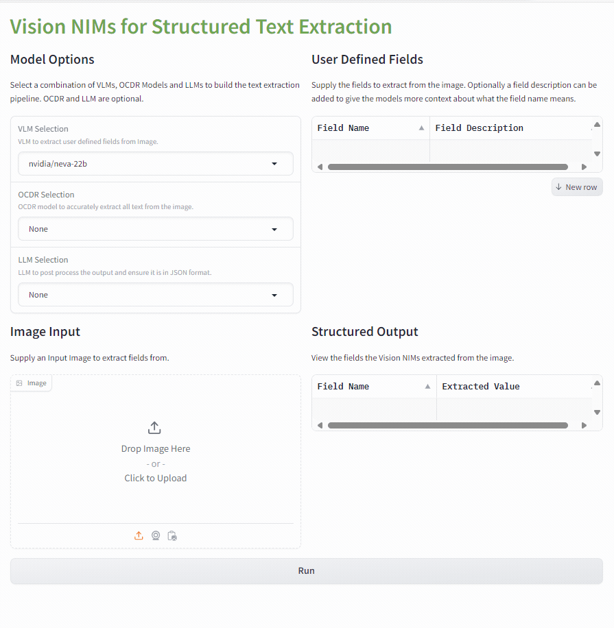
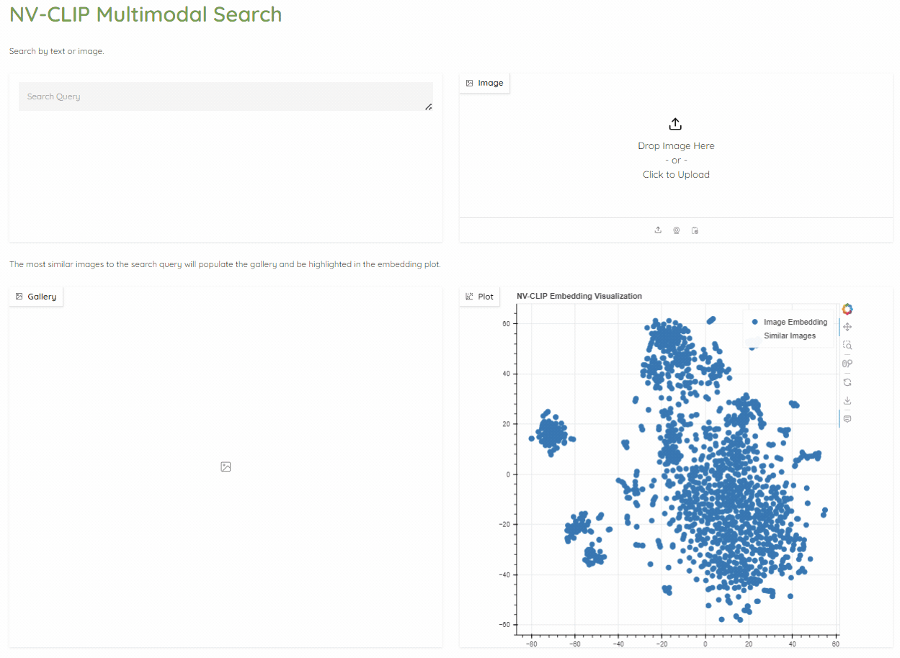

# Vision Workflows with NVIDIA NIM

This submodule includes NIM based workflows for vision applications. To get access to this submodule, do one of the following: 

1) Clone nvidia/GenerativeAIExamples recursively
```
git clone https://github.com/nvidia/GenerativeAIExamples --recurse-submodules
```

2) If you have already cloned the repository without the ```--recurse-submodules``` flag then you can manually pull the submodule
```
git submodule update --init
```

3) You can also clone the vision workflow repository directly
```
git clone https://github.com/NVIDIA/metropolis-nim-workflows.git
```

Once the submodule is pulled or you have cloned the repository directly you can explore the available vision NIM workflows. 

## Available Workflows

### [VLM Alert System](https://github.com/NVIDIA/metropolis-nim-workflows/blob/main/nim_workflows/vlm_alerts/README.md)
<p float="left">

</p>

### [Structured Text Extraction](https://github.com/NVIDIA/metropolis-nim-workflows/tree/main/nim_workflows/vision_text_extraction)
<p float="left">

</p>

### [NVCLIP Multimodal Search](https://github.com/NVIDIA/metropolis-nim-workflows/tree/main/nim_workflows/nvclip_multimodal_search)
<p float="left">

</p>

### [NV-DINOv2 Few Shot Classification](https://github.com/NVIDIA/metropolis-nim-workflows/tree/main/nim_workflows/nvdinov2_few_shot)
<p float="left">

</p>


To learn more, view [this page](https://github.com/NVIDIA/metropolis-nim-workflows)


